# JVM, Threading & Multithreading — Senior/Principal Engineer Interview Guide (11+ Years)

> Production-grade questions asked at FAANG, product-based companies, and high-scale startups for Tech Lead, Principal, and Staff Engineer roles. Every answer starts from the problem, explains the mechanism at depth, and ends with how to say it in an interview.

---

## Table of Contents

### JVM Internals
- [Q1. How does JVM execute your code — Interpret vs JIT](#q1-how-does-jvm-execute-your-code--interpret-vs-jit)
- [Q2. What is JVM Memory Structure — What lives where](#q2-what-is-jvm-memory-structure--what-lives-where)
- [Q3. How does GC actually work — Mark, Sweep, Compact](#q3-how-does-gc-actually-work--mark-sweep-compact)
- [Q4. What are GC Roots — How does GC know what's alive](#q4-what-are-gc-roots--how-does-gc-know-whats-alive)
- [Q5. What are GC Pauses and why do they freeze your application](#q5-what-are-gc-pauses-and-why-do-they-freeze-your-application)
- [Q6. G1GC vs ZGC — What they are and when to pick which](#q6-g1gc-vs-zgc--what-they-are-and-when-to-pick-which)

### Object & Class Loading
- [Q7. How does ClassLoader work — What is parent delegation](#q7-how-does-classloader-work--what-is-parent-delegation)
- [Q8. ClassNotFoundException vs NoClassDefFoundError](#q8-classnotfoundexception-vs-noclassdeffounderror)
- [Q9. What happens when you write new MyObject() — Step by step](#q9-what-happens-when-you-write-new-myobject--step-by-step)

### Threading Fundamentals
- [Q10. What is a Thread — How is it different from a Process](#q10-what-is-a-thread--how-is-it-different-from-a-process)
- [Q11. What is a Thread Stack vs Heap — What lives where](#q11-what-is-a-thread-stack-vs-heap--what-lives-where)
- [Q12. What happens when you call Thread.start() — Step by step](#q12-what-happens-when-you-call-threadstart--step-by-step)

### Synchronization & Locks
- [Q13. What is a Race Condition — Real example](#q13-what-is-a-race-condition--real-example)
- [Q14. What is synchronized — How does it work at JVM level](#q14-what-is-synchronized--how-does-it-work-at-jvm-level)
- [Q15. What is Deadlock — How to detect and prevent](#q15-what-is-deadlock--how-to-detect-and-prevent)
- [Q16. What is volatile — What it solves and what it does NOT solve](#q16-what-is-volatile--what-it-solves-and-what-it-does-not-solve)
- [Q17. What is ReentrantLock — How is it different from synchronized](#q17-what-is-reentrantlock--how-is-it-different-from-synchronized)

### Java Memory Model
- [Q18. Why can two threads see different values for the same variable](#q18-why-can-two-threads-see-different-values-for-the-same-variable)
- [Q19. What is Happens-Before — Why does it matter](#q19-what-is-happens-before--why-does-it-matter)
- [Q20. What is Double-Checked Locking bug — Why does it break without volatile](#q20-what-is-double-checked-locking-bug--why-does-it-break-without-volatile)

### Concurrent Data Structures
- [Q21. How does ConcurrentHashMap work internally](#q21-how-does-concurrenthashmap-work-internally)
- [Q22. What is AtomicInteger — What is CAS at CPU level](#q22-what-is-atomicinteger--what-is-cas-at-cpu-level)
- [Q23. What is ThreadLocal — How is it stored, what is the memory leak](#q23-what-is-threadlocal--how-is-it-stored-what-is-the-memory-leak)

### Thread Coordination
- [Q24. What is wait()/notify() — How do they work](#q24-what-is-waitnotify--how-do-they-work)
- [Q25. CountDownLatch vs CyclicBarrier vs Semaphore](#q25-countdownlatch-vs-cyclicbarrier-vs-semaphore)
- [Q26. What is ExecutorService — How does a thread pool work internally](#q26-what-is-executorservice--how-does-a-thread-pool-work-internally)

### Modern Java
- [Q27. What are Virtual Threads — How are they different from platform threads](#q27-what-are-virtual-threads--how-are-they-different-from-platform-threads)
- [Q28. What is CompletableFuture — How does it work](#q28-what-is-completablefuture--how-does-it-work)

---

### 🔴 Production-Level: 11+ Years / Principal / Staff Engineer Questions

#### Java 21 — New Features (Critical)
- [Q29. What are Sealed Classes and when do you use them in production](#q29-what-are-sealed-classes-and-when-do-you-use-them-in-production)
- [Q30. What are Records — Internals, limitations, and production patterns](#q30-what-are-records--internals-limitations-and-production-patterns)
- [Q31. What is Pattern Matching for switch — How does it change domain modeling](#q31-what-is-pattern-matching-for-switch--how-does-it-change-domain-modeling)
- [Q32. What are Sequenced Collections in Java 21](#q32-what-are-sequenced-collections-in-java-21)
- [Q33. Virtual Threads deep dive — Pinning, structured concurrency, pitfalls](#q33-virtual-threads-deep-dive--pinning-structured-concurrency-pitfalls)
- [Q34. What is Structured Concurrency — Why it matters for production services](#q34-what-is-structured-concurrency--why-it-matters-for-production-services)
- [Q35. What is Scoped Values — How it replaces ThreadLocal in virtual thread world](#q35-what-is-scoped-values--how-it-replaces-threadlocal-in-virtual-thread-world)

#### JVM Deep Internals (Principal-Level)
- [Q36. How does Escape Analysis work and what optimizations does it enable](#q36-how-does-escape-analysis-work-and-what-optimizations-does-it-enable)
- [Q37. What is GraalVM Native Image — Trade-offs vs JIT in production](#q37-what-is-graalvm-native-image--trade-offs-vs-jit-in-production)
- [Q38. How do you diagnose and fix a production memory leak — Step by step](#q38-how-do-you-diagnose-and-fix-a-production-memory-leak--step-by-step)
- [Q39. How do you tune GC for a latency-sensitive service — Real parameters](#q39-how-do-you-tune-gc-for-a-latency-sensitive-service--real-parameters)

#### Concurrency Patterns (Senior/Lead Level)
- [Q40. What is the Fork/Join framework — Work stealing explained](#q40-what-is-the-forkjoin-framework--work-stealing-explained)
- [Q41. What is Livelock vs Starvation — How do you detect and fix in production](#q41-what-is-livelock-vs-starvation--how-do-you-detect-and-fix-in-production)
- [Q42. How do you implement a production-grade rate limiter using Java concurrency](#q42-how-do-you-implement-a-production-grade-rate-limiter-using-java-concurrency)
- [Q43. What is StampedLock — When is it better than ReentrantReadWriteLock](#q43-what-is-stampedlock--when-is-it-better-than-reentrantreadwritelock)

#### System Design & Architecture (10+ Year Questions)
- [Q44. How do you design a thread-safe cache with TTL expiry at scale](#q44-how-do-you-design-a-thread-safe-cache-with-ttl-expiry-at-scale)
- [Q45. How do you handle backpressure in a Java service under load](#q45-how-do-you-handle-backpressure-in-a-java-service-under-load)
- [Q46. What is the difference between optimistic and pessimistic locking — When to use each](#q46-what-is-the-difference-between-optimistic-and-pessimistic-locking--when-to-use-each)

#### Observability & Production Debugging
- [Q47. How do you find a thread deadlock in a live production JVM](#q47-how-do-you-find-a-thread-deadlock-in-a-live-production-jvm)
- [Q48. How do you profile CPU hotspots in production Java without stopping the JVM](#q48-how-do-you-profile-cpu-hotspots-in-production-java-without-stopping-the-jvm)

---

## JVM Internals

---

### Q1. How does JVM execute your code — Interpret vs JIT

#### The Problem First
You write Java. The CPU doesn't understand Java. The CPU only understands native machine instructions specific to its architecture (x86, ARM). So how does your Java code actually run?

#### Step 1 — Compilation to Bytecode
When you run `javac MyClass.java`, the compiler produces `MyClass.class` containing **bytecode** — not machine code, not Java source. It is an intermediate instruction set designed for the JVM.

```
MyClass.java  →  javac  →  MyClass.class (bytecode)
```

Bytecode looks like this (simplified):
```
iload_1       // load integer from variable slot 1
iload_2       // load integer from variable slot 2
iadd          // add them
istore_3      // store result in slot 3
```

This bytecode is **platform independent** — same `.class` file runs on Windows, Linux, Mac. The JVM on each platform translates it to native code.

#### Step 2 — Interpreter
When JVM starts, it reads bytecode and executes it **line by line**, translating each bytecode instruction to a native CPU instruction on the fly.

```
Bytecode instruction → JVM reads → translates → CPU executes
Bytecode instruction → JVM reads → translates → CPU executes
... (repeated for every instruction, every call)
```

This works but is **slow** — translation overhead on every single instruction every single time.

#### Step 3 — JIT Compiler
JVM watches which methods are called **frequently**. These are called **hot methods**. When a method crosses the call threshold (~10,000 times by default), JVM compiles it once to native machine code and caches it.

```
First 10,000 calls  →  interpreted (slow)
After threshold     →  JIT compiles to native code → stored in Code Cache
All future calls    →  native code runs directly on CPU (fast, no translation)
```

```
Code Cache
┌──────────────────────────────────────────┐
│  processAdRequest()  →  native code      │
│  parseKafkaEvent()   →  native code      │
│  computeMetric()     →  native code      │
└──────────────────────────────────────────┘
```

#### What JIT Also Does — Optimizations

**Inlining:** Replaces method call with the method body directly — no call overhead.
```java
// You wrote:
String name = user.getName();

// JIT converts to (if getName() just returns a field):
        String name = user.name;  // direct field access
```

**Dead code elimination:** If JIT proves a branch never executes, it removes it entirely.

**Loop unrolling:** A loop running 4 times becomes 4 sequential statements — no loop overhead.

#### The Critical Side Effect
JIT is allowed to **reorder your instructions** if it thinks two operations are independent. Fine for single-threaded code. In multithreaded code — this is the source of every subtle concurrency bug. This is why `volatile` and `synchronized` exist — they tell JIT: **do not reorder across this point**.

#### How to Explain in Interview
> "JVM first compiles Java source to bytecode using javac. At runtime, the interpreter executes bytecode line by line — correct but slow. JVM monitors hot methods. Once a method crosses the call threshold, JIT compiles it to native machine code and caches it in the Code Cache — all future calls run native code directly. JIT also optimizes: inlining, dead code elimination, loop unrolling. The important side effect is JIT can reorder instructions for optimization — which is why we need volatile and synchronized to prevent unsafe reordering in concurrent code."

---

### Q2. What is JVM Memory Structure — What lives where

#### The Problem First
Your JVM process gets memory from the OS. Not all data is the same — some is per-thread, some is shared, some is class metadata. JVM organizes memory into regions based on what lives there and how long it lives.

#### The Complete Picture
```
JVM Process Memory
│
├── Heap  (shared across ALL threads)
│   ├── Young Generation
│   │   ├── Eden          ← new objects born here
│   │   ├── Survivor 0    ← survived 1+ GC cycles
│   │   └── Survivor 1    ← survived 1+ GC cycles
│   └── Old Generation    ← long-lived objects promoted here
│
├── Metaspace             ← class metadata (field names, method bytecode)
│
├── Code Cache            ← JIT compiled native code
│
└── Per-Thread (one per thread, private)
    ├── Thread Stack      ← stack frames for method calls
    └── PC Register       ← a tiny memory space that holds the address of the currently executing JVM instruction (bytecode instruction pointer).
```

#### Heap — Where Objects Live
Every `new MyObject()` allocates on the heap. The heap is **shared across all threads** — this is exactly why thread safety is a problem. Two threads can read/write the same object simultaneously.

```java
User user = new User("Ranveer");
//           ^^^^^^^^^^^^^^^^^^  lives on HEAP
//    ^^^^   this reference variable lives on THREAD STACK
```

#### Thread Stack — Private Per Thread
Each thread has its own stack. No other thread can see it. Every method call pushes a **stack frame** containing local variables, method parameters, and a return address.

```
Thread 1 Stack              Thread 2 Stack
┌────────────────┐          ┌────────────────┐
│ parseEvent()   │          │ queryDB()      │
│  local vars    │          │  local vars    │
├────────────────┤          ├────────────────┤
│ processMsg()   │          │ handleReq()    │
│  local vars    │          │  local vars    │
├────────────────┤          ├────────────────┤
│ main()         │          │ main()         │
└────────────────┘          └────────────────┘
       PRIVATE                    PRIVATE
```

When a method returns — its frame is popped. Local variables are gone instantly. **No GC needed for stack memory.**

**Key rule:**
- Primitives (`int`, `long`, `boolean`) declared inside a method → live on stack
- Objects → always on heap. The **reference** (pointer) lives on stack, the actual object on heap.

```java
void process() {
        int count = 5;           // count → stack (gone when method returns)
        User user = new User();  // reference → stack, User object → heap
        }
// method returns → stack frame gone → count gone → reference gone
// User object still on heap until GC collects it
```

#### Metaspace — Where Classes Live
When JVM loads `UserService.class`, it stores the class structure in Metaspace: field names, method bytecode, constant pool. Metaspace is **not on the heap** — GC doesn't collect it normally. It grows as you load more classes. In apps with dynamic class loading (Spring AOP, bytecode generation), Metaspace can leak if classes load but never unload.

#### Code Cache — Where JIT Output Lives
JIT-compiled native code lives here. Fixed size. If it fills up, JVM stops JIT compiling and falls back to interpretation — you see this as sudden throughput drop after running fine for hours.

#### How to Explain in Interview
> "JVM memory has two main areas — heap and non-heap. Heap is shared across all threads — all objects live here, divided into Young Generation (Eden + Survivors) and Old Generation. Non-heap has three parts: Metaspace stores class metadata and grows as classes load; Code Cache stores JIT-compiled native code; each thread gets a private Thread Stack holding stack frames for method calls. Primitives and references live on the stack, actual objects always on the heap. Stack memory is reclaimed instantly when a method returns — no GC involved."

---

### Q3. How does GC actually work — Mark, Sweep, Compact

#### The Problem First
Objects are created on heap constantly. Some become unreachable — no variable points to them anymore. If JVM never reclaims that memory, heap fills up and you get `OutOfMemoryError`. GC's job: find dead objects, reclaim memory, without corrupting live objects.

#### Step 1 — Mark (Find What's Alive)
GC doesn't look for dead objects. It looks for **live objects** — everything else is treated as garbage.

GC starts from **GC Roots** (thread stacks, static fields) and traverses all object references like a graph:

```
GC Roots
├── Thread 1 stack → UserService → UserRepository → DataSource ✓ MARKED
├── Thread 2 stack → OrderService → null
└── Static fields  → ConfigCache → Map<String, Config> ✓ MARKED

// DataSource is reachable → marked alive
// An orphaned Session object with no references → NOT marked → garbage
```

#### Step 2 — Sweep (Reclaim Dead Objects)
GC scans the heap. Any object without the mark bit set — its memory is reclaimed.

```
Before sweep:
[User:LIVE] [Order:DEAD] [Config:LIVE] [Session:DEAD] [Cache:LIVE]

After sweep:
[User:LIVE] [FREE      ] [Config:LIVE] [FREE         ] [Cache:LIVE]
```

**Problem:** memory is now **fragmented**. Free space is scattered in small chunks. A new large object might not fit even if total free space is enough.

#### Step 3 — Compact (Fix Fragmentation)
GC moves all live objects together, closing the gaps:

```
Before compact:
[User] [FREE] [Config] [FREE] [Cache] [FREE][FREE][FREE]

After compact:
[User] [Config] [Cache] [FREE ][FREE ][FREE ][FREE ][FREE ]
                        ↑
                        large contiguous free block
```

**Cost:** compaction requires moving objects and updating every reference pointing to moved objects. This requires the application to **stop completely**.

#### Stop The World — The Real Problem
During Mark and Compact, all application threads must pause so GC has a consistent view of the heap. This is called **Stop The World (STW)**.

```
Timeline:
App running → [STW: GC PAUSE] → App running → [STW: GC PAUSE] → App running
               ↑                               ↑
               users see latency spike         users see latency spike
```

- **Minor GC** (Young Gen only) → short pause, ~5–20ms, scans only Eden
- **Full GC** (entire heap) → pause can be **seconds** on large heaps → kills SLAs

#### How to Explain in Interview
> "GC works in three phases. Mark: starting from GC Roots — thread stacks, static fields — GC traverses the object graph and marks everything reachable as alive. Sweep: unmarked objects are reclaimed. Compact: live objects are moved together to eliminate fragmentation. The critical problem is Stop The World — during mark and compact, all app threads pause so GC has a consistent view. Minor GC only scans Young Gen — short pause. Full GC scans the entire heap — can pause for seconds. Reducing Full GC frequency is the core of GC tuning."

---

### Q4. What are GC Roots — How does GC know what's alive

#### The Problem First
GC needs a starting point to trace live objects. GC Roots are always-alive references — the fixed set GC starts from.

#### The Four GC Roots

**1. Local variables on thread stacks**
```java
void process() {
        User user = new User();
        // user is on the stack → GC Root → User object is alive
        // GC runs here → User object NOT collected
        }
// method returns → user gone from stack → User object now eligible for GC
```

**2. Static fields**
Static fields live as long as the class is loaded — usually entire app lifetime.
```java
public class Cache {
    static Map<String, Data> store = new HashMap<>();
    // store and everything reachable from it → always alive
}
```
> **This is why static collections cause memory leaks** — objects put in are always reachable from a static root and never collected unless explicitly removed.

**3. Active Java threads**
Thread objects themselves are GC roots — everything they reference is alive.

**4. JNI References**
Native C/C++ code holding references to Java objects — GC must keep those alive.

#### Reference Types — Controlling GC Behavior
Java gives you four reference strengths to influence GC:

| Type | Collected when | Use case |
|------|---------------|----------|
| Strong (`new`) | Never while referenced | Default — everything |
| Soft (`SoftReference`) | Only when memory low | In-memory caches |
| Weak (`WeakReference`) | Next GC cycle | Canonicalized mappings |
| Phantom (`PhantomReference`) | After finalization | Off-heap cleanup tracking |

```java
// Soft reference — good for caches
SoftReference<byte[]> cache = new SoftReference<>(new byte[1024]);
        byte[] data = cache.get(); // may return null if GC collected it

// Weak reference — good for maps where key liveness controls entry
        WeakReference<User> ref = new WeakReference<>(user);
// ref.get() returns null after next GC if no strong reference to user exists
```

#### How to Explain in Interview
> "GC starts from GC Roots — always-live references: local variables on thread stacks, static fields, active thread objects, and JNI references. From these roots GC traverses the entire object graph — anything reachable is marked live, everything else is garbage. Classic memory leak: a static Map holding objects — it's always reachable from a static root so nothing in it is ever collected unless you explicitly remove it."

---

### Q5. What are GC Pauses and why do they freeze your application

#### The Problem First
GC needs to move objects around and update references. If your application threads keep running while GC moves objects, a thread might read a stale reference to a location that was just moved. Data corruption. So JVM stops all threads — Stop The World.

#### Why STW is Unavoidable for Some Phases

During **compaction**, GC moves `UserService` from address `0x1000` to `0x2000`. Every reference in the heap pointing to `0x1000` must be updated to `0x2000`. If Thread 1 is mid-read of that reference while GC updates it — you get a corrupted pointer. There is no safe way to do this concurrently without stopping threads.

#### Minor GC vs Full GC Pause

**Minor GC — Young Generation only**
- Triggered when Eden fills up
- Scans only Eden + Survivor spaces (small)
- Most objects in Eden are dead (they're short-lived) — very few survivors to copy
- Pause: **5–20ms** — usually acceptable
- Happens frequently (every few seconds under load)

**Full GC — Entire Heap**
- Triggered when Old Gen fills up
- Scans entire heap — could be 4GB, 8GB, 32GB
- Pause: **hundreds of ms to seconds** depending on heap size
- Kills p99/p999 latency SLAs
- What you spend all your GC tuning effort avoiding

#### What Causes Full GC — The Common Triggers

**1. Old Gen fills up**
Objects promoted from Young Gen faster than Full GC can collect. Usually caused by objects living longer than expected (large caches, session objects, static collections).

**2. Metaspace fills up**
Too many classes loaded (common with reflection-heavy frameworks, dynamic proxies). Triggers Full GC to try to unload unused classes.

**3. Explicit `System.gc()` call**
Someone in the codebase called `System.gc()`. This is almost always wrong in production. Disable with `-XX:+DisableExplicitGC`.

**4. Promotion failure**
Old Gen doesn't have contiguous space for a promoted object even if total free space exists — fragmentation triggered Full GC.

#### How to Diagnose GC Pauses in Production

```bash
# Enable GC logging (Java 9+)
-Xlog:gc*:file=/var/log/app/gc.log:time,uptime:filecount=5,filesize=20m

# Key metrics to watch:
# - GC pause duration
# - GC frequency
# - Heap occupancy after GC (if it keeps rising → memory leak)
```

Tools: GCViewer, GCEasy, Java Flight Recorder (JFR).

#### How to Explain in Interview
> "GC pauses happen because some GC phases — specifically compaction — require moving objects and updating all references pointing to them. If application threads run during this, they might read stale pointers — data corruption. So JVM stops all threads during these phases. Minor GC only scans Young Gen — short pause, usually fine. Full GC scans the entire heap — can pause for seconds and directly breaks latency SLAs. The main causes of Full GC are Old Gen filling up (too many long-lived objects), Metaspace exhaustion, or heap fragmentation causing promotion failures."

---

### Q6. G1GC vs ZGC — What they are and when to pick which

#### The Problem First
The basic Mark-Sweep-Compact GC stops your entire application. For large heaps this pause grows with heap size — 8GB heap, several seconds of pause. You need GC algorithms that reduce or eliminate STW pauses.

#### G1GC — Region Based GC

G1 (Garbage First) divides the entire heap into equal-sized **regions** (~1–32MB each) instead of fixed Eden/Old layout.

```
Heap with G1:
┌────┬────┬────┬────┬────┬────┬────┬────┐
│ E  │ S  │ O  │ E  │ O  │ E  │ F  │ O  │
└────┴────┴────┴────┴────┴────┴────┴────┘
E=Eden  S=Survivor  O=Old  F=Free
```

Any region can play any role. G1 tracks how much garbage each region contains and **collects the most garbage-dense regions first** (that's where the name "Garbage First" comes from).

**Key feature — Concurrent Marking:**
G1 does most of the mark phase **concurrently** — while your application runs. Only a small final re-mark phase requires STW. This keeps pauses short and predictable.

**You configure a pause target:**
```
-XX:MaxGCPauseMillis=200  // tell G1 "try to keep pauses under 200ms"
```
G1 adjusts how many regions to collect per cycle to stay within that budget.

**When to use G1:**
- Heap size 4GB–32GB
- You need balanced throughput + reasonable latency
- Default since Java 9 — good choice for most Spring Boot services

#### ZGC — Concurrent Everything

ZGC's goal: **pause under 1ms regardless of heap size**.

ZGC achieves this by doing **almost everything concurrently** — mark, relocate, and reference update all happen while your application runs. It uses a technique called **load barriers** — small code injected at every object read that checks if the object has been moved and fixes the reference on the fly.

```
ZGC timeline:
App running ──────────────────────────────────────────────────────→
                ↑              ↑           ↑
           concurrent      concurrent   concurrent
             mark           relocate    ref update
             (no pause)     (no pause)  (no pause)
                                              ↑
                                         tiny STW (~1ms)
                                         for root scanning
```

**Cost:** Load barriers add ~5–10% CPU overhead on every object read. You trade CPU for latency.

**When to use ZGC:**
- Heap > 32GB (G1 pauses grow with heap size, ZGC stays flat)
- p99/p999 latency is critical — ad decisioning, trading systems, real-time APIs
- Available since Java 15 (production ready)

#### Comparison Table

| | G1GC | ZGC |
|---|---|---|
| Pause duration | 10–200ms (tunable) | <1ms (fixed) |
| Pause scales with heap? | Yes | No |
| CPU overhead | Low | ~5–10% extra |
| Best heap size | 4–32GB | Any, best >32GB |
| Available since | Java 7 | Java 15 |
| Use case | General purpose | Latency critical |

#### How to Explain in Interview
> "G1 divides the heap into equal-sized regions and collects the most garbage-dense regions first — Garbage First. It does concurrent marking while the app runs, keeping STW pauses short and predictable. You give it a pause target like 200ms and it tries to stay within it. ZGC goes further — it does marking, relocation, and reference updating all concurrently using load barriers. Pauses stay under 1ms regardless of heap size. The trade-off is ~5–10% extra CPU overhead from the load barriers. I'd use G1 for most services. For latency-critical paths — like our ad decisioning engine at Zee5 — ZGC is the right call."

---

## Object & Class Loading

---

### Q7. How does ClassLoader work — What is parent delegation

#### The Problem First
Your code references `com.myapp.UserService`. JVM needs to find and load the bytecode for this class. But there are multiple places bytecode can come from — JDK classes, third-party JARs, your app JARs. ClassLoader is the component that finds and loads class bytecode.

#### Three Built-in ClassLoaders

```
Bootstrap ClassLoader      ← loads java.*, javax.* from JDK itself
        ↑ parent
Platform ClassLoader       ← loads JDK extension classes (Java 9+)
        ↑ parent
Application ClassLoader    ← loads YOUR classes from classpath
```

#### Parent Delegation — How It Works

When Application ClassLoader is asked to load `com.myapp.UserService`:

```
Step 1: Application ClassLoader asks its parent (Platform) first
Step 2: Platform asks its parent (Bootstrap) first
Step 3: Bootstrap looks — not in JDK → returns "not found"
Step 4: Platform looks — not in extensions → returns "not found"
Step 5: Application ClassLoader looks in classpath → finds it → loads it
```

**Why this design?** Security. Without parent delegation, someone could put a malicious `java.lang.String` in the classpath and replace the real one. With parent delegation, Bootstrap always loads `java.lang.String` first — your fake one never gets a chance.

#### Where It Breaks — Real Production Scenario

In a web server like Tomcat, each webapp needs its own classes isolated from other webapps. Tomcat uses **child-first loading** for webapp classes — breaks parent delegation intentionally.

```
Tomcat ClassLoader hierarchy:
Bootstrap
    └── System
          └── Common (shared Tomcat classes)
                ├── WebApp1 ClassLoader (child-first for WEB-INF/lib)
                └── WebApp2 ClassLoader (child-first for WEB-INF/lib)
```

At Cisco on Cloud Foundry, we had a classpath conflict — the platform provided Spring 5.1, our app needed Spring 5.3. Root cause: classloader delegation order meant the platform's Spring was loaded first. Fix: shade (repackage) our Spring dependency to a different namespace.

#### How to Explain in Interview
> "ClassLoader follows parent delegation — when asked to load a class, it always asks its parent first before checking its own classpath. Bootstrap loads JDK classes, Platform loads extensions, Application loads your code. Parent delegation prevents malicious classes from shadowing JDK classes. In practice it breaks down in environments needing classloader isolation like Tomcat — each webapp uses child-first loading so its own classes take priority over shared classes."

---

### Q8. ClassNotFoundException vs NoClassDefFoundError

#### The Problem First
Both mean a class wasn't found. But they happen in different situations and have different root causes. Confusing them wastes debugging time.

#### ClassNotFoundException — Checked Exception
Thrown when you **explicitly ask** for a class by name at runtime and it's not on the classpath.

```java
// Explicit dynamic loading:
Class<?> clazz = Class.forName("com.mysql.jdbc.Driver");
//                              ↑
// If MySQL JAR is missing from classpath → ClassNotFoundException
```

**Root cause:** Missing JAR. Fix: add the dependency.

#### NoClassDefFoundError — Error
Class was present at **compile time** but missing at runtime. Or more subtly — the class exists but **failed to initialize**.

```java
public class Config {
    static {
        // static initializer block
        String value = System.getenv("REQUIRED_ENV");
        if (value == null) throw new RuntimeException("missing env var");
        // ↑ this throws during class initialization
    }
}

    // Somewhere else:
    Config c = new Config(); // → NoClassDefFoundError (not the original RuntimeException!)
```

**The subtle case:** Class initialization fails (static block throws). JVM marks the class as permanently failed. Every subsequent attempt to use it throws `NoClassDefFoundError` — not the original exception. You need to look **earlier in the logs** for `ExceptionInInitializerError` to find the real cause.

#### Comparison

| | ClassNotFoundException | NoClassDefFoundError |
|---|---|---|
| Type | Checked Exception | Error |
| When | Explicit `Class.forName()` | Class was compiled but missing/failed at runtime |
| Root cause | Missing JAR | Missing JAR at runtime OR failed static init |
| Fix | Add dependency | Add JAR OR fix static initializer |

#### How to Explain in Interview
> "ClassNotFoundException is a checked exception thrown when you explicitly load a class by name via Class.forName() and the class isn't on the classpath — missing JAR. NoClassDefFoundError is an Error thrown when a class was present at compile time but missing or broken at runtime. The tricky case is when a class exists but its static initializer threw an exception — JVM marks it permanently failed and throws NoClassDefFoundError on every subsequent use. Always look earlier in the logs for ExceptionInInitializerError to find the real root cause."

---

### Q9. What happens when you write new MyObject() — Step by step

#### The Complete Sequence

```java
MyObject obj = new MyObject(42);
```

**Step 1 — Class Loading Check**
JVM checks if `MyObject` is already loaded in Metaspace. If not, ClassLoader finds and loads `MyObject.class` — reads bytecode, stores class structure in Metaspace.

**Step 2 — Memory Allocation**
JVM calculates how many bytes `MyObject` needs (all fields + object header). Allocates that space in **Eden** (or Old Gen if object is large).

JVM uses **bump pointer allocation** — Eden has a pointer to the next free address. Allocation = advance the pointer by N bytes. Extremely fast — essentially just one pointer increment.

```
Eden memory:
[obj1][obj2][obj3][  FREE  ←pointer  ...............]
                         ↑
                  new MyObject() → pointer advances, space reserved here
```

**Step 3 — Zero Initialization**
JVM zeroes all fields in the newly allocated space. This is why Java fields have default values (`int` = 0, `boolean` = false, Object = null) without explicit initialization. It's a JVM security requirement — you must never see leftover memory from a previous object.

**Step 4 — Constructor Execution**
JVM calls `<init>` method (constructor). Fields are set to your specified values.

```java
new MyObject(42)
// field value = 0 after step 3
// field value = 42 after step 4 (constructor sets it)
```

**Step 5 — Reference Assignment**
The reference to the new object is stored in `obj` on the thread stack.

#### The Reordering Risk
Steps 4 and 5 can be **reordered by JIT**. JVM may assign the reference to `obj` (step 5) before the constructor finishes (step 4). In a multithreaded scenario, another thread may see `obj != null` but with uninitialized fields. This is the double-checked locking bug — solved with `volatile`.

#### How to Explain in Interview
> "new MyObject() does five things: checks if the class is loaded in Metaspace and loads it if not; allocates memory in Eden using bump pointer allocation; zeroes all fields — this is why Java fields have default values; runs the constructor to set field values; and assigns the reference. The subtle risk is JIT can reorder constructor completion and reference assignment — another thread may see a non-null reference to a partially constructed object. volatile prevents this reordering."

---

## Threading Fundamentals

---

### Q10. What is a Thread — How is it different from a Process

#### The Problem First
You want to do multiple things at the same time — handle 100 HTTP requests simultaneously. You need concurrency. Understanding the difference between processes and threads is fundamental to understanding the JVM threading model.

#### Process — Isolated Execution Unit
A process is a running program. The OS gives it:
- Its own dedicated memory space (heap, stack, code segment)
- Its own file handles, network connections
- Isolation — one process cannot directly access another process's memory

```
Process A (JVM)          Process B (Nginx)
┌──────────────┐         ┌──────────────┐
│ Memory space │         │ Memory space │
│ Heap         │         │ Heap         │
│ Code         │         │ Code         │
│ File handles │         │ File handles │
└──────────────┘         └──────────────┘
       ↑                        ↑
   ISOLATED                 ISOLATED
(cannot touch each other)
```

#### Thread — Lightweight Execution within a Process
A thread is a unit of execution **inside** a process. Multiple threads in one process:
- **Share** the process heap (same objects visible to all threads)
- **Share** code and static fields
- Each has its **own private stack**
- Each has its **own PC register** (which instruction it's currently at)

```
JVM Process
┌─────────────────────────────────────────────┐
│  Shared Heap (all threads see same objects)  │
│                                              │
│  Thread 1          Thread 2      Thread 3   │
│  ┌──────────┐      ┌──────────┐  ┌────────┐ │
│  │ Stack    │      │ Stack    │  │ Stack  │ │
│  │ PC Reg   │      │ PC Reg   │  │ PC Reg │ │
│  └──────────┘      └──────────┘  └────────┘ │
└─────────────────────────────────────────────┘
```

#### OS Thread vs JVM Thread (Platform Thread)
A Java platform thread maps **1:1 to an OS thread**. Creating a Java thread creates an OS thread. The OS scheduler decides when each thread runs.

**Cost of a platform thread:**
- ~1MB stack memory (default, configurable with `-Xss`)
- OS resources for scheduling
- Context switch overhead when OS swaps between threads

This is why you can't create 100,000 platform threads — you'd need 100GB of stack memory. Thread pools exist to reuse a fixed set of threads.

#### How to Explain in Interview
> "A process is an isolated execution unit with its own memory space. Threads live inside a process — they share the heap and static fields but each has its own private stack and PC register. Sharing the heap is what makes threads useful (shared data, fast communication) and dangerous (race conditions, visibility issues). A Java platform thread maps 1:1 to an OS thread — costs ~1MB stack plus OS scheduling overhead. This cost is why we use thread pools instead of creating a new thread per request."

---

### Q11. What is a Thread Stack vs Heap — What lives where

#### Stack — Per Thread, Private

Each thread's stack holds **stack frames** — one frame per method call currently in progress on that thread.

Each frame contains:
- Local variables (primitives stored directly, object references stored as pointers)
- Method parameters
- Return address (where to jump back when method returns)
- Operand stack (JVM's working space for executing bytecode instructions)

```java
void methodA() {
        int x = 10;            // x lives in methodA's stack frame
        User u = new User();   // u (reference) in frame, User object in heap
        methodB(x);
        }

        void methodB(int val) {    // val is a copy — separate frame
        String s = "hello";    // s reference in frame, "hello" in heap (string pool)
        }
```

```
Stack at this moment:
┌──────────────────┐   ← top of stack (currently executing)
│ methodB frame    │
│   val = 10       │
│   s → [heap]     │
├──────────────────┤
│ methodA frame    │
│   x = 10         │
│   u → [heap]     │
└──────────────────┘
```

**StackOverflowError** — stack is full because recursion is too deep. Each recursive call adds a frame. When stack memory is exhausted, JVM throws `StackOverflowError`.

#### Heap — Shared, GC Managed

All objects live here. Every `new` goes to heap. GC manages collection. All threads can read/write the same heap objects — this is what requires synchronization.

#### The Key Distinction for Interviews

| | Stack | Heap |
|---|---|---|
| Scope | Private per thread | Shared across all threads |
| Contains | Local vars, primitives, references | All objects |
| Lifetime | Method lifetime (auto freed on return) | Until GC collects |
| Thread safe? | Yes (private) | No (requires synchronization) |
| Error when full | StackOverflowError | OutOfMemoryError |

#### How to Explain in Interview
> "Stack is private per thread — holds stack frames for active method calls. Each frame has local variables and the return address. Primitives declared in a method live directly on the stack. Object references live on the stack but the actual object is on the heap. Stack memory is reclaimed instantly when a method returns — no GC needed. Heap is shared across all threads — all objects live here, GC manages collection. The shared heap is why thread safety is necessary — two threads can simultaneously access and modify the same object."

---
Here's the updated section with a better JVM explanation and a flow diagram:

---

### Q12. What happens when you call `Thread.start()` — Step by step

#### The Problem First
You have a `Runnable`. You want it to execute concurrently. `Thread.start()` triggers this — but it doesn't just call `run()`. There's a specific sequence involving the JVM and OS.


#### Step by Step (Platform Thread)

```java
Thread t = new Thread(() -> System.out.println("running in new thread"));
t.start();
```

**Step 1** — `start()` validates state. If already started → `IllegalThreadStateException`. A thread can only be started once.

**Step 2** — JVM calls native `start0()`. `Thread.start()` is a thin Java wrapper around `private native void start0()`, implemented in C inside the JVM.

**Step 3** — OS creates a new thread. `start0()` calls the OS API (e.g. `pthread_create` on Linux). The OS allocates a new thread with its own ~1MB stack and adds it to the scheduler.

**Step 4** — JVM links the `Thread` object to the OS thread. Mapping is recorded internally.

**Step 5** — OS places the thread in the run queue. It does **not** run immediately — it waits for a CPU core.

**Step 6** — When scheduled, `run()` executes. OS assigns a CPU core. JVM calls `run()` on the new thread's stack.

**Step 7** — Thread terminates. `run()` returns, JVM marks it terminated, OS frees the stack and resources.

---

#### `start()` vs `run()` — Classic Interview Trap

   ```java
    t.start(); // CORRECT — new OS thread, run() executes on it
    t.run();   // WRONG  — run() on current thread, no new thread
   ```
---

#### How to Explain in Interview

> `Thread.start()` validates the thread hasn't been started, then calls the native `start0()` method in C. For a platform thread (pre Java 21), this asks the OS to create a new thread with its own stack — the thread lands in the OS run queue and waits for a CPU core. When scheduled, the JVM calls `run()`. In Java 21+, virtual threads skip this — the JVM parks and schedules them itself on a shared pool of OS threads, which is why you can have millions of them. Common mistake: calling `run()` directly just runs on the current thread — no new thread is created."
---

## Synchronization & Locks

---

### Q13. What is a Race Condition — Real example

#### The Problem First
Two threads share the same data. Both read it, both modify it, both write it back. The result depends on which thread ran first — unpredictable, non-reproducible bugs that only appear under load.

#### Concrete Example

```java
public class Counter {
    private int count = 0;

    public void increment() {
        count++;  // looks atomic, is NOT
    }
}
```

`count++` is three operations:
1. Read `count` from memory → CPU register
2. Add 1 in register
3. Write new value back to memory

```
count = 0 initially

Thread 1                    Thread 2
read count → 0
                            read count → 0
add 1 → 1
                            add 1 → 1
write count = 1
                            write count = 1

Final count = 1   ← WRONG. Should be 2.
```

Thread 2 read the old value before Thread 1 wrote back. Thread 1's increment was lost. This is a **lost update** — the most common race condition.

#### Another Example — Check Then Act

```java
// Looks safe, is not
if (map.get(key) == null) {
        map.put(key, value);  // two threads both pass the null check, both put
        }
```

Both threads check `null` (both see null). Both proceed to put. Second put overwrites first. This is **check-then-act** race condition.

#### Real Production Case
At Zee5, our ad impression counter used a shared `int` incremented per request. Under 1500 QPS we saw impression counts consistently 10–15% lower than actual requests — lost updates from unsynchronized increments. Fix: `AtomicLong` with `incrementAndGet()`.

#### How to Explain in Interview
> "A race condition happens when two threads access shared mutable state and the final result depends on the execution order. Classic example: count++ looks like one operation but is three — read, add, write. Two threads can both read the same value, both add 1, both write back — you lose one increment. The fix is either synchronization (serialize the three operations) or atomic operations like AtomicInteger which use a single CPU-level CAS instruction."

---

### Q14. What is synchronized — How does it work at JVM level
You asked two things:

1. How do threads actually wait when `synchronized` is on `this`
2. Mark Word is in which object when we use `this` vs class level

Let me answer both properly.

---

## When you write `synchronized(this)`

`this` = the current instance. So if you do:

```java
Counter c1 = new Counter();
        c1.increment(); // synchronized(this) means lock is on c1 object
```

The Mark Word of **c1 object on the heap** is used as the lock.

```
Heap
┌──────────────────────────┐
│   c1  (Counter object)   │
│  ┌────────────────────┐  │
│  │ Mark Word (8 bytes)│  │ ← THIS is where lock state is stored
│  │ Klass Pointer      │  │
│  ├────────────────────┤  │
│  │ int count = 0      │  │
│  └────────────────────┘  │
└──────────────────────────┘
```

---

## What Happens When 3 Threads Come — Step by Step

```java
Counter c1 = new Counter();

// T1, T2, T3 all call this simultaneously
        c1.increment();
```

All three threads are fighting over the **same c1 object's Mark Word**.

---

### T1 arrives first — Biased Lock

T1 looks at c1's Mark Word — it is unlocked. T1 does a CAS and writes its own thread ID into the Mark Word.

```
c1 Mark Word:
BEFORE: [ unused | age | 01 ]        ← unlocked
AFTER:  [ T1-thread-id | age | 101 ] ← biased to T1
```

T1 enters the block. Executes `count++`.

---

### T2 arrives while T1 is inside — Lightweight Lock

T2 looks at c1's Mark Word. Sees T1's thread ID. Biased lock is revoked.

Lock upgrades to **lightweight**. T2 tries CAS to write a pointer to its own stack frame into the Mark Word. Fails — T1 still holds it.

T2 now **spins** — sits in a busy loop checking the Mark Word:

```
T2:
while (c1.markWord is still locked by T1) {
    // keep checking
    // no OS call yet
    // burning CPU in a loop
}
```

JVM has an adaptive spin limit. If T1 releases quickly — T2 grabs it without OS involvement. If T1 takes too long — spinning stops and lock inflates.

---

### T3 also arrives — Lock Inflates to Heavyweight

Now both T2 and T3 are waiting. JVM inflates the lock.

JVM creates an **ObjectMonitor** structure and stores a pointer to it inside c1's Mark Word:

```
c1 Mark Word:
[ pointer → ObjectMonitor | 10 ] ← inflated
```

ObjectMonitor is the actual waiting room:

```
ObjectMonitor (for c1)
┌──────────────────────────────────┐
│ owner      = T1                  │ ← who currently holds the lock
│ EntryList  = [ T2, T3 ]          │ ← threads blocked waiting to acquire
│ WaitSet    = [ ]                 │ ← threads that called wait() — empty for now
│ recursion  = 1                   │ ← how many times owner locked it (reentrant count)
└──────────────────────────────────┘
```

T2 and T3 are **parked by the OS** — fully asleep, zero CPU. OS is responsible for waking them.

---

### T1 finishes — Releases the lock

T1 exits the synchronized block. JVM executes `MONITOREXIT` bytecode.

ObjectMonitor picks one thread from EntryList — say T2. OS **unparks** T2 — wakes it up.

T2 acquires the lock — becomes new owner:

```
ObjectMonitor (for c1)
┌──────────────────────────────────┐
│ owner      = T2                  │ ← T2 now owns
│ EntryList  = [ T3 ]              │ ← T3 still sleeping
│ WaitSet    = [ ]                 │
└──────────────────────────────────┘
```

T2 executes `count++`. Releases. T3 wakes up. Same process.

---

## Now Your Actual Question — Which Object's Mark Word?

### Case 1 — Two different instances

```java
Counter c1 = new Counter();
        Counter c2 = new Counter();
```

These are two separate objects on the heap — two separate Mark Words — two completely independent locks.

```
Heap
┌───────────────────┐     ┌───────────────────┐
│ c1                │     │ c2                │
│ Mark Word: T1 🔒  │     │ Mark Word: free   │
│ count = 0         │     │ count = 0         │
└───────────────────┘     └───────────────────┘
```

T1 locking `c1` does NOT block T2 locking `c2`. They are on different objects — different Mark Words — different locks. Both run in parallel.

---

### Case 2 — Same instance, multiple threads

```java
Counter c1 = new Counter();
// T1, T2, T3 all call c1.increment()
```

All three hit the **same Mark Word** — same object — so they block each other. Only one can be inside at a time.

---

### Case 3 — Class level lock `synchronized(Counter.class)`

```java
public void increment() {
synchronized(Counter.class) {
        count++;
        }
        }
```

`Counter.class` is also a real object — a `java.lang.Class` instance. It lives on the heap. It has its own Mark Word. And there is exactly **one** `Counter.class` object in the entire JVM.

```
Heap
┌───────────────────┐     ┌───────────────────┐
│ c1                │     │ c2                │
│ Mark Word: free   │     │ Mark Word: free   │
└───────────────────┘     └───────────────────┘

┌─────────────────────────────────┐
│ Counter.class object            │
│ Mark Word: T1 🔒                │ ← ONE lock shared by ALL instances
└─────────────────────────────────┘
```

Now T1 working on `c1` and T2 working on `c2` — both are blocked by the same `Counter.class` Mark Word. Even though they are different instances, the lock is on the Class object — so they block each other.

---

### Case 4 — `static synchronized` method

```java
public static synchronized void reset() {
        count = 0;
        }
```

This is exactly the same as `synchronized(Counter.class)`. Static method has no `this` — so JVM uses the Class object as the lock automatically.

---

## The Rule — One Line

```
synchronized(X) → lock is on X's Mark Word
                  wherever X lives on the heap,
                  that object's Mark Word is the lock
```

| What you write | Which object's Mark Word |
|---|---|
| `synchronized(this)` | The current instance |
| `synchronized(Counter.class)` | The Class object (one per JVM) |
| `synchronized(anyObj)` | That specific object |
| `public synchronized void m()` | Same as `synchronized(this)` |
| `public static synchronized void m()` | Same as `synchronized(Counter.class)` |

---


### Q15. What is Deadlock — How to detect and prevent

#### The Problem First
Thread 1 holds Lock A, waiting for Lock B. Thread 2 holds Lock B, waiting for Lock A. Both wait forever. Your service hangs.

#### Concrete Example

```java
Object lockA = new Object();
        Object lockB = new Object();

// Thread 1
synchronized(lockA) {
        Thread.sleep(100);
synchronized(lockB) {  // waits for lockB
        // work
        }
        }

// Thread 2
synchronized(lockB) {
        Thread.sleep(100);
synchronized(lockA) {  // waits for lockA
        // work
        }
        }
```

```
Thread 1: holds A → waiting for B ──┐
Thread 2: holds B → waiting for A ←─┘
                    ↑
               DEADLOCK — circular wait, neither can proceed
```

#### Four Conditions for Deadlock (all four must hold)
1. **Mutual exclusion** — resource held by only one thread at a time
2. **Hold and wait** — thread holds one resource while waiting for another
3. **No preemption** — resources can't be forcibly taken
4. **Circular wait** — circular chain of threads each waiting for the next

Break any one condition → no deadlock possible.

#### How to Detect Deadlock

**In production — thread dump:**
```bash
kill -3 <pid>          # sends SIGQUIT, JVM prints thread dump to stdout
# or
jstack <pid>           # prints thread dump
```

Thread dump will show:
```
Thread-1: BLOCKED waiting for lock <0x...> held by Thread-2
Thread-2: BLOCKED waiting for lock <0x...> held by Thread-1
```
JVM also detects deadlocks and labels them explicitly in the dump.

**Programmatically:**
```java
ThreadMXBean bean = ManagementFactory.getThreadMXBean();
        long[] deadlockedThreads = bean.findDeadlockedThreads();
// returns null if no deadlock, otherwise thread IDs
```

#### How to Prevent Deadlock

**Prevention 1 — Lock ordering (most reliable)**
Always acquire multiple locks in the same order everywhere in the codebase.

```java
// ALWAYS lock A before B — everywhere, no exceptions
synchronized(lockA) {
synchronized(lockB) {
        // work
        }
        }
```

**Prevention 2 — tryLock with timeout (ReentrantLock)**
```java
if (lockA.tryLock(100, TimeUnit.MILLISECONDS)) {
        try {
        if (lockB.tryLock(100, TimeUnit.MILLISECONDS)) {
        try {
        // work
        } finally { lockB.unlock(); }
        }
        } finally { lockA.unlock(); }
        }
// If tryLock fails → release what you hold and retry later
// No indefinite wait → no deadlock
```

**Prevention 3 — Avoid nested locks**
Design so you never need two locks simultaneously.

#### How to Explain in Interview
> "Deadlock requires four conditions simultaneously: mutual exclusion, hold-and-wait, no preemption, and circular wait. Classic case: Thread 1 holds Lock A waiting for B, Thread 2 holds B waiting for A — circular wait, both blocked forever. Detection: jstack thread dump shows BLOCKED threads with circular lock dependency. JVM's ThreadMXBean.findDeadlockedThreads() detects it programmatically. Prevention: lock ordering — always acquire multiple locks in the same fixed order everywhere. Or use ReentrantLock.tryLock() with timeout — thread releases what it holds if it can't acquire the next lock within the timeout."

---

### Q16. What is volatile — What it solves and what it does NOT solve

#### The Problem First
Modern CPUs have per-core caches (L1/L2). Thread 1 (Core 1) writes a value — it goes to Core 1's cache first, not immediately to RAM. Thread 2 (Core 2) reads the same variable — reads from Core 2's cache, which still has the old value. Thread 2 **never sees Thread 1's write**.

```
Core 1                Core 2
┌──────────┐          ┌──────────┐
│ L1 cache │          │ L1 cache │
│ stop=true│          │ stop=false│   ← stale!
└────┬─────┘          └────┬─────┘
     │                     │
┌────┴─────────────────────┴─────┐
│          Main Memory           │
│          stop=true             │
└────────────────────────────────┘
```

#### What volatile Does

**Visibility guarantee:** A write to a `volatile` variable is immediately visible to all threads. JVM inserts a **memory barrier** — a CPU instruction that forces the store buffer to flush to main memory, and forces other cores to invalidate their cached copy.

```java
volatile boolean stop = false;

// Thread 1
        stop = true;  // memory barrier inserted → flushed to main memory

// Thread 2
        while (!stop) { }  // reads from main memory each time → sees true
```

**Ordering guarantee:** JVM will not reorder instructions across a volatile write or read. Everything written before a volatile write is visible to anyone who reads that volatile variable.

#### What volatile Does NOT Do — Atomicity

```java
volatile int counter = 0;
        counter++;  // STILL NOT ATOMIC
```

`counter++` = read + add + write. `volatile` ensures visibility of the final write, but two threads can still both read `0`, both add `1`, both write `1`. You still lose an update. For atomic compound operations → use `AtomicInteger`.

#### When to Use volatile

```java
// CORRECT use — single writer, multiple readers, simple flag
volatile boolean initialized = false;

// Thread 1 (writer)
        loadConfiguration();
        initialized = true;  // volatile write — everything before this is visible after

// Thread 2 (reader)
        if (initialized) {
        useConfiguration();  // safe — sees fully loaded config
        }
```

#### How to Explain in Interview
> "volatile solves the CPU cache visibility problem. Without it, each CPU core may cache a variable locally — one thread's write may not be visible to another thread reading the same variable from a different core's cache. volatile inserts memory barriers that force writes to flush to main memory and force reads to bypass the cache. It also prevents JIT from reordering instructions across the volatile access. What volatile does NOT do is atomicity — counter++ is still three operations and still has race conditions. volatile is for visibility of simple flags or references. For atomic compound operations you need AtomicInteger or synchronized."

---

### Q17. What is ReentrantLock — How is it different from synchronized

#### The Problem First
`synchronized` works but it's inflexible — you can't timeout while waiting, you can't interrupt a waiting thread, and you can't have multiple wait conditions. `ReentrantLock` gives you all of this.

#### What Reentrant Means
Same thread can acquire the lock multiple times without deadlocking itself:

```java
synchronized(this) {
synchronized(this) {  // same thread — works fine, JVM tracks depth
        // nested call
        }
        }
```
`ReentrantLock` is the same — same thread can call `lock()` N times, must call `unlock()` N times.

#### What ReentrantLock Adds Over synchronized

**1. tryLock() — don't wait forever**
```java
ReentrantLock lock = new ReentrantLock();

        if (lock.tryLock(200, TimeUnit.MILLISECONDS)) {
        try {
        // got the lock within 200ms
        } finally {
        lock.unlock();
        }
        } else {
        // couldn't get lock — do something else, avoid deadlock
        }
```

**2. lockInterruptibly() — cancel waiting threads**
```java
lock.lockInterruptibly();
// If Thread.interrupt() is called on this thread while waiting → InterruptedException thrown
// With synchronized, interrupt() has no effect on a blocked thread
```

**3. Condition variables — multiple wait sets**
```java
ReentrantLock lock = new ReentrantLock();
        Condition notFull  = lock.newCondition();
        Condition notEmpty = lock.newCondition();

// Producer
        lock.lock();
        try {
        while (queue.isFull()) notFull.await();   // wait on notFull condition
        queue.add(item);
        notEmpty.signal();  // signal only consumers — not producers
        } finally { lock.unlock(); }

// Consumer
        lock.lock();
        try {
        while (queue.isEmpty()) notEmpty.await(); // wait on notEmpty condition
        queue.poll();
        notFull.signal();   // signal only producers — not consumers
        } finally { lock.unlock(); }
```

With `synchronized` + `wait()`/`notify()` you have one wait set per object — `notify()` wakes a random waiting thread (could wake another producer when you need a consumer). With `Condition`, you have separate wait sets.

**4. Fairness option**
```java
new ReentrantLock(true);  // fair — threads acquire in FIFO order
// Prevents starvation but reduces throughput
```

#### When to Use Which

| Use `synchronized` when | Use `ReentrantLock` when |
|---|---|
| Simple critical section | Need timeout on lock acquisition |
| No need for interruptibility | Need to interrupt waiting threads |
| One wait condition is enough | Need multiple distinct wait conditions |
| Want JVM optimization (lock elision) | Need fairness guarantee |

#### How to Explain in Interview
> "ReentrantLock provides everything synchronized does plus three things: tryLock with timeout — avoids deadlock by bailing if lock isn't available within a time limit; lockInterruptibly — allows a waiting thread to be interrupted and bail out, which synchronized doesn't support; and Condition variables — multiple wait sets on one lock. With synchronized and notify() you wake a random waiting thread. With Condition.signal() you wake only threads waiting on that specific condition — critical for producer-consumer where you want to signal only consumers, not other producers."

---

## Java Memory Model

---

### Q18. Why can two threads see different values for the same variable

#### The Problem First
You'd expect that if Thread 1 writes `x = 5`, Thread 2 reading `x` immediately after sees `5`. This is often not true. Understanding why is the foundation of all concurrent programming in Java.

#### Three Reasons

**Reason 1 — CPU Cache**
```
Core 1 (Thread 1)          Core 2 (Thread 2)
x = 5 → L1 cache           reads x → L1 cache = 0 (stale)
         ↓ (not yet)
      Main Memory: x = 0
```
The write is buffered in Core 1's L1 cache (store buffer). It hasn't propagated to main memory or Core 2's cache yet. Core 2 reads the old value.

**Reason 2 — JIT Reordering**
JIT may decide two operations are independent and swap their order:
```java
// You wrote:
ready = true;
        data = 42;

// JIT may execute as:
        data = 42;
        ready = true;
// or even cache 'ready' in a register and never re-read from memory
```

**Reason 3 — Compiler Optimization**
JIT may see that `stop` is never written in Thread 2's loop and optimize it to:
```java
// Original:
while (!stop) { doWork(); }

// JIT optimized (stop hoisted out of loop — read once):
        if (!stop) {
        while (true) { doWork(); }  // infinite loop — never re-reads stop
        }
```

#### The Fix — Establish Happens-Before
All three problems are solved by establishing a **happens-before** relationship. The mechanisms: `volatile`, `synchronized`, `Thread.start()`, `Thread.join()`.

#### How to Explain in Interview
> "Two threads can see different values for the same variable for three reasons: CPU cache — writes go to the writing core's cache first, not immediately to main memory or other cores' caches; JIT reordering — JIT is allowed to reorder independent operations for optimization; and compiler hoisting — JIT may read a variable once and cache it in a register, never re-reading. All three are solved by establishing happens-before relationships through volatile, synchronized, or Thread.join()."

---

### Q19. What is Happens-Before — Why does it matter

#### The Concept

Happens-before is a guarantee: if operation A **happens-before** operation B, then:
1. All writes done by A (and everything before A) are **visible** to B
2. All those writes appear to have happened **before** B's reads

It's not about time. Two operations can happen at the same real time but still have a happens-before relationship if the JMM guarantees it.

#### The Six Happens-Before Rules

**Rule 1 — Program order within a thread**
```java
// Within one thread — line 1 always happens-before line 2
x = 5;      // line 1
        y = x + 1;  // line 2 — guaranteed to see x=5
```

**Rule 2 — Monitor unlock → next lock**
```java
synchronized(lock) { x = 5; }  // unlock
// ...
synchronized(lock) { y = x; }  // next lock — guaranteed to see x=5
```

**Rule 3 — volatile write → subsequent volatile read**
```java
volatile int v;
        v = 5;       // write
// ...
        int r = v;   // read — guaranteed to see 5 (and everything written before v=5)
```

**Rule 4 — Thread.start()**
```java
x = 5;
        t.start();
// Inside t.run() — guaranteed to see x=5
```

**Rule 5 — Thread.join()**
```java
t.join();
// After join returns — guaranteed to see everything t wrote
```

**Rule 6 — Transitivity**
If A happens-before B and B happens-before C, then A happens-before C.

#### Why This Matters in Practice

```java
// Without happens-before — BROKEN
int data = 0;
        boolean ready = false;

// Thread 1
        data = 42;
        ready = true;

// Thread 2
        if (ready) {
        System.out.println(data);  // may print 0! No happens-before established
        }
```

```java
// With volatile — CORRECT
int data = 0;
volatile boolean ready = false;

// Thread 1
        data = 42;
        ready = true;   // volatile write — happens-before any subsequent read of ready
        // also: data=42 happens-before ready=true (program order, rule 1)
        // transitivity: data=42 happens-before any read of ready

// Thread 2
        if (ready) {
        System.out.println(data);  // guaranteed to see 42
        }
```

#### How to Explain in Interview
> "Happens-before is the JMM's formal guarantee of visibility and ordering between threads. If A happens-before B, all writes made before A are visible to B and appear ordered before B. The key rules: unlock of a monitor happens-before the next lock of the same monitor; volatile write happens-before any subsequent read of that variable; Thread.start() happens-before anything inside run(); Thread.join() means everything the thread did happens-before join() returns. Without an explicit happens-before relationship between two threads, the JVM makes zero guarantees about visibility."

---

### Q20. What is Double-Checked Locking bug — Why does it break without volatile

#### The Problem First
You want a singleton. Creating it is expensive (loads config, opens DB connection). You want lazy initialization — create only when first needed. And you want thread-safe initialization without paying synchronization cost on every access.

#### Attempt 1 — Broken (No synchronization)
```java
private static Singleton instance;

public static Singleton getInstance() {
        if (instance == null) {
        instance = new Singleton();  // two threads both enter here simultaneously
        }
        return instance;
        }
// Race condition — two Singleton instances created
```

#### Attempt 2 — Correct but slow
```java
public static synchronized Singleton getInstance() {
        if (instance == null) {
        instance = new Singleton();
        }
        return instance;
        }
// Thread-safe but every call pays synchronized cost
// After initialization, singleton never changes — why pay lock cost?
```

#### Attempt 3 — Double-Checked Locking (Broken without volatile)
```java
private static Singleton instance;  // ← MISSING volatile

public static Singleton getInstance() {
        if (instance == null) {              // check 1 — no lock
synchronized (Singleton.class) {
        if (instance == null) {      // check 2 — inside lock
        instance = new Singleton();
        }
        }
        }
        return instance;
        }
```

**Why this breaks:** `instance = new Singleton()` is three steps:
1. Allocate memory
2. Run constructor (initialize fields)
3. Assign reference to `instance`

JIT can reorder step 3 before step 2:
1. Allocate memory
2. Assign reference to `instance`  ← reordered! instance is now non-null
3. Run constructor

```
Thread 1: allocate → ASSIGN instance (non-null, unconstructed) → run constructor
Thread 2:               reads instance → non-null! → returns broken object
```

Thread 2 passes check 1 (instance is non-null), skips synchronized block, returns the partially constructed object whose constructor hasn't run yet. **Data corruption.**

#### The Fix — volatile

```java
private static volatile Singleton instance;  // volatile prevents reordering
```

`volatile` inserts a **memory barrier** before the volatile write. The barrier prevents steps 2 and 3 from reordering — constructor MUST complete before the reference is assigned.

```java
// Correct DCL
private static volatile Singleton instance;

public static Singleton getInstance() {
        if (instance == null) {
synchronized (Singleton.class) {
        if (instance == null) {
        instance = new Singleton();  // volatile write — no reorder possible
        }
        }
        }
        return instance;
        }
```

After first initialization: `instance` is non-null. All subsequent calls hit check 1, see non-null, return immediately — no synchronization cost. Thread-safe and fast.

#### How to Explain in Interview
> "Double-checked locking attempts lazy singleton initialization without paying synchronization cost after initialization. The bug: object construction is three steps — allocate, construct, assign. JIT can reorder to allocate, assign, construct. Thread 2 sees non-null assignment, skips the synchronized block, and gets a partially constructed object. Fix: volatile on the instance field. volatile inserts a memory barrier that prevents the assign from moving before the constructor completes. After that fix, DCL is the standard pattern for lazy initialization in Java."

---

## Concurrent Data Structures

---

### Q21. How does ConcurrentHashMap work internally

#### The Problem First
`HashMap` is not thread-safe — concurrent gets and puts corrupt internal structure. `Hashtable` and `Collections.synchronizedMap()` use a single lock for the entire map — every read and write blocks all other reads and writes. Under high concurrency this is a bottleneck.

#### How ConcurrentHashMap Solves It (Java 8+)

ConcurrentHashMap uses an array of buckets. Each bucket is the head of a linked list (or red-black tree if list grows long). Instead of one lock for the whole map, it locks at the **individual bucket level**.

```
ConcurrentHashMap internal array:
Index:  [0]      [1]      [2]      [3]      [4]
         │        │        │        │        │
        A→D      B        C→E→F    null     G
```

**Get — completely lock free:**
Read operations use `volatile` reads — no locking at all. The `Node.val` and `Node.next` fields are `volatile`, so reads always see the latest values without synchronization.

```java
// Simplified get:
Node<K,V> e = tabAt(tab, (n - 1) & hash);  // volatile array read
        while (e != null) {
        if (e.hash == hash && key.equals(e.key))
        return e.val;  // volatile read
        e = e.next;
        }
```

**Put — locks only the head node of the target bucket:**
```java
// Simplified put:
Node<K,V> f = tabAt(tab, i);
        if (f == null) {
        casTabAt(tab, i, null, new Node<>(...));  // CAS for empty bucket — no lock
        } else {
synchronized (f) {  // lock ONLY this bucket's head node
        // insert or update in this bucket's chain
        }
        }
```

Two puts to different buckets proceed **in parallel** — they lock different nodes. Only puts to the same bucket block each other.

#### Treeification
When a bucket's linked list grows beyond **8 nodes**, it's converted to a **red-black tree**. Search in a linked list is O(n), in a tree is O(log n). Happens automatically under hash collisions.

#### size() is approximate
`ConcurrentHashMap.size()` doesn't lock the whole map. It uses a distributed counter (`LongAdder` internally) — approximate, may not be exactly accurate at the instant of the call. Use `mappingCount()` which returns `long` for large maps.

#### computeIfAbsent is atomic
```java
map.computeIfAbsent(key, k -> expensiveComputation(k));
// The check-then-put is one atomic operation
// expensiveComputation called only once even with concurrent access for same key
```
This replaces the unsafe `if (map.get(key) == null) { map.put(key, compute()); }` pattern.

#### How to Explain in Interview
> "ConcurrentHashMap uses bucket-level locking instead of a single global lock. Gets are completely lock-free — Node fields are volatile, reads need no synchronization. Puts use CAS for empty buckets and synchronized on the bucket's head node for non-empty buckets — only threads putting into the same bucket block each other, all other buckets proceed in parallel. Buckets convert to red-black trees at 8 nodes to keep lookup O(log n) under hash collisions. computeIfAbsent is atomic — the entire check-and-put is one operation, safe for concurrent initialization patterns."

---

### Q22. What is AtomicInteger — What is CAS at CPU level

#### The Problem First
You need to increment a counter from multiple threads. `synchronized` works but pays OS syscall cost. You need something thread-safe but lock-free.

#### CAS — Compare And Swap

CAS is a **single native CPU instruction** (`CMPXCHG` on x86). It atomically does:

```
if (memory[address] == expected) {
    memory[address] = newValue
    return true      // success
} else {
    return false     // someone else changed it, try again
}
```

"Atomically" means: the CPU completes the entire read-compare-write as one indivisible operation. No other thread can see an intermediate state. No lock needed — hardware guarantees it.

#### How AtomicInteger.incrementAndGet() Uses CAS

```java
// Actual JDK source (simplified):
public final int incrementAndGet() {
        int current;
        int next;
        do {
        current = get();           // read current value (volatile read)
        next = current + 1;        // compute new value
        } while (!compareAndSet(current, next));  // CAS — retry if someone else changed it
        return next;
        }
```

```
Thread 1                    Thread 2
read current=0
compute next=1
                            read current=0
                            compute next=1
CAS(expected=0, new=1)
→ memory is 0 → SUCCESS     CAS(expected=0, new=1)
  memory = 1                → memory is NOW 1 (Thread 1 changed it)
                              expected=0 ≠ actual=1 → FAIL → RETRY
                            read current=1
                            compute next=2
                            CAS(expected=1, new=2) → SUCCESS
                              memory = 2

Final: 2 ✓
```

No lock. No OS. No thread parking. Loser retries — wastes one CAS attempt but doesn't block.

#### When CAS Breaks Down — High Contention

If 100 threads all try CAS simultaneously, 1 succeeds, 99 retry. Then 1 of those 99 succeeds, 98 retry. Under extreme contention: CPU cycles wasted on failed retries.

**Solution: `LongAdder`**
Instead of one value all threads compete on, `LongAdder` maintains a **cell array** — each thread updates its own cell.

```
LongAdder internal state:
Thread 1 → Cell[0] += 1
Thread 2 → Cell[1] += 1
Thread 3 → Cell[2] += 1
Thread 4 → Cell[0] += 1  ← some threads share cells, still less contention

sum() = Cell[0] + Cell[1] + Cell[2] + base
```

Sum is only computed when `sum()` is called — reads are slower, writes are much faster under high contention. For metrics counters (like QPS tracking), `LongAdder` is the right choice.

#### How to Explain in Interview
> "AtomicInteger uses CAS — Compare And Swap — a single CPU instruction that atomically reads a value, compares it to expected, and writes new value only if they match. If two threads both try to CAS, one succeeds, the other retries. No lock, no OS syscall — pure hardware atomicity. Under high contention, many threads retry constantly, wasting CPU. LongAdder solves this by distributing updates across a cell array — each thread updates its own cell, reducing contention from N threads to N/cells. Sum is computed lazily. For high-throughput counters like request metrics, LongAdder significantly outperforms AtomicLong."

---

### Q23. What is ThreadLocal — How is it stored, what is the memory leak

#### The Problem First
You want to store per-request data (user ID, trace ID, DB connection) and access it from anywhere in the call stack without passing it as a method parameter through every layer.

#### What ThreadLocal Does

```java
ThreadLocal<String> requestId = new ThreadLocal<>();

// In request filter (entry point):
        requestId.set("req-12345");

// Deep in service layer — no parameter passing needed:
        String id = requestId.get();  // returns "req-12345" for THIS thread
// returns something else for other threads
```

Each thread sees its own isolated value. Thread 1's `set()` has zero effect on Thread 2's `get()`.

#### How It's Actually Stored in JVM

ThreadLocal does NOT store values in itself. It uses the **Thread object** as the storage container.

Each `Thread` object has a field:
```java
ThreadLocal.ThreadLocalMap threadLocals;
```

This is a map owned by the Thread. When you call `threadLocal.set(value)`:

```java
// Simplified:
Thread currentThread = Thread.currentThread();
        currentThread.threadLocals.set(this, value);
//                          ^^^^ ThreadLocal instance as the key
```

When you call `threadLocal.get()`:
```java
Thread currentThread = Thread.currentThread();
        return currentThread.threadLocals.get(this);
```

```
Thread 1 object                Thread 2 object
┌─────────────────────┐        ┌─────────────────────┐
│ threadLocals map:   │        │ threadLocals map:    │
│  requestIdTL → "A"  │        │  requestIdTL → "B"  │
│  userTL → User1     │        │  userTL → User2      │
└─────────────────────┘        └─────────────────────┘
```

The ThreadLocal instance is just the key. The value lives in the Thread's own map.

#### The Memory Leak — Thread Pools

In a thread pool (Tomcat, Spring's `@Async`, Executor), **threads are reused**. A thread handles request A, then request B, then request C — same OS thread.

```
Thread-1 handles Request A:
  requestId.set("req-A")
  ... process ...
  method returns
  (YOU FORGOT requestId.remove())

Thread-1 handles Request B:  ← same thread reused
  requestId.get() → "req-A"  ← WRONG! Request B sees Request A's data
```

Two problems:
1. **Data leak** — Request B sees Request A's data (security bug in multi-tenant apps)
2. **Memory leak** — ThreadLocalMap holds strong reference to the value. Thread never dies (pool keeps it alive) → value never GC'd. If value is large (connection, byte array) → memory leak grows with time.

#### The Fix

```java
// Always in a finally block:
try {
        requestId.set("req-12345");
        processRequest();
        } finally {
        requestId.remove();  // ALWAYS clean up
        }
```

Spring's `RequestContextHolder` and `SecurityContextHolder` do this for you — they clear ThreadLocal at the end of each request in a servlet filter. But any custom ThreadLocal you create is **your responsibility** to clean up.

#### How to Explain in Interview
> "ThreadLocal doesn't store the value in itself — it uses the Thread object as storage. Each Thread has a ThreadLocalMap where the ThreadLocal instance is the key and your value is the value. This gives per-thread isolation — each thread has its own entry in its own map. The classic production bug is thread pool memory leak: threads are reused across requests. If you set a ThreadLocal in request A and forget to call remove(), the next request on the same thread reads request A's data — security bug in multi-tenant apps, and a memory leak because the ThreadLocalMap holds a strong reference to the value and the pooled thread never dies. Fix: always call threadLocal.remove() in a finally block."

---

## Thread Coordination

---

### Q24. What is wait()/notify() — How do they work

#### The Problem First
Producer thread fills a queue. Consumer thread reads from it. When the queue is empty, consumer should stop and wait — not spin in a loop burning CPU. When producer adds something, consumer should wake up.

#### The Mechanism

`wait()` and `notify()` are methods on **every Java object** (inherited from `Object`). They work with `synchronized` — you must hold the object's monitor to call them.

```java
Object queue = new Object();
        List<Integer> buffer = new ArrayList<>();

// Consumer thread
synchronized(queue) {
        while (buffer.isEmpty()) {
        queue.wait();  // releases lock AND parks thread
        // thread is now sleeping — not consuming CPU
        }
        int item = buffer.remove(0);
        }

// Producer thread
synchronized(queue) {
        buffer.add(item);
        queue.notify();  // wakes ONE waiting thread
        }
```

#### What `wait()` Does — Three Things Atomically

1. **Releases the monitor** — other threads can now acquire the lock
2. **Parks the thread** — thread goes to sleep (no CPU usage)
3. **Adds thread to wait set** — a queue of threads waiting on this object

#### What `notify()` Does

Moves ONE thread from the wait set to the entry set (competing for the lock). That thread wakes up and tries to re-acquire the lock — it doesn't run immediately.

`notifyAll()` wakes ALL waiting threads — they all compete for the lock, one wins, others go back to waiting.

#### Why `while` Loop — Spurious Wakeup

```java
// WRONG:
if (buffer.isEmpty()) {
        queue.wait();
        }

// CORRECT:
        while (buffer.isEmpty()) {
        queue.wait();
        }
```

**Spurious wakeup:** The OS can wake a `wait()`ing thread for no reason — no `notify()` was called, the condition hasn't changed. This is an OS-level behavior the JVM inherits. The `while` loop rechecks the condition after waking — if still empty, waits again.

Always use `while`, never `if`, when checking the condition around `wait()`.

#### How to Explain in Interview
> "wait() and notify() enable inter-thread coordination without busy-waiting. wait() does three things atomically: releases the object's monitor, parks the thread, and adds it to the object's wait set — thread is fully asleep, zero CPU. notify() moves one thread from the wait set back to competing for the lock. Critical rule: always use while loop around wait(), not if. The OS can issue spurious wakeups — waking a thread without notify() being called. The while loop rechecks the condition and goes back to wait if the condition is still false."

---

### Q25. CountDownLatch vs CyclicBarrier vs Semaphore

#### The Problem First
Three different coordination problems:
1. Wait for N tasks to complete before proceeding
2. Make N threads meet at a checkpoint before all continue
3. Limit how many threads can access a resource simultaneously

Three different tools.

---

#### CountDownLatch — Wait for N events

```java
CountDownLatch latch = new CountDownLatch(3);  // count = 3

// Three worker threads, each calls:
        latch.countDown();  // count decrements: 3 → 2 → 1 → 0

// Main thread waits:
        latch.await();  // blocks until count reaches 0
// continues after all 3 workers are done
```

**Key property:** one-time use — count can't be reset. Once it hits 0, all `await()` calls return immediately from that point on.

**Real use case:** Service startup — wait for DB connection, Kafka consumer, and config load to all complete before accepting HTTP requests.

```java
CountDownLatch startupLatch = new CountDownLatch(3);
        initDatabase(startupLatch);    // calls countDown() when ready
        initKafka(startupLatch);       // calls countDown() when ready
        initConfig(startupLatch);      // calls countDown() when ready
        startupLatch.await();          // wait for all three
        startHttpServer();             // now safe to start
```

---

#### CyclicBarrier — Make N threads meet at a checkpoint

```java
CyclicBarrier barrier = new CyclicBarrier(3);  // 3 threads must meet

// Each of the 3 threads calls:
        barrier.await();  // blocks here until all 3 have called await()
// all 3 continue TOGETHER after all have arrived
```

**Key difference from latch:** CyclicBarrier is **reusable** — after all threads pass, it resets automatically for the next round.

**Real use case:** Parallel computation phases — split work across N threads, wait for all to finish phase 1, then all proceed to phase 2.

```java
// Parallel matrix multiplication:
// Round 1: all threads compute their partition
barrier.await();  // wait for all partitions done
// Round 2: all threads combine results
        barrier.await();  // wait again
// Round 3: all threads write output
```

---

#### Semaphore — Limit concurrent access

```java
Semaphore semaphore = new Semaphore(5);  // max 5 threads allowed simultaneously

// Each thread:
        semaphore.acquire();  // claims one permit — blocks if 0 permits available
        try {
        callExternalApi();  // only 5 threads in here at once
        } finally {
        semaphore.release();  // returns permit
        }
```

**Real use case:** Rate limiting calls to an external service — only allow N concurrent outbound connections.

At Zee5, we used a Semaphore to limit concurrent calls to the third-party ad exchange to 50 — beyond that, requests queued rather than overwhelming the exchange.

---

#### Quick Comparison

| | CountDownLatch | CyclicBarrier | Semaphore |
|---|---|---|---|
| Purpose | Wait for N events | Sync N threads at checkpoint | Limit concurrent access |
| Reusable? | No | Yes | Yes |
| Who counts down? | Workers | Waiting threads themselves | Acquirers |
| Unblocks when? | Count reaches 0 | All threads arrived | Permit available |

#### How to Explain in Interview
> "Three different coordination problems — three different tools. CountDownLatch: one thread waits for N other threads to complete. Workers call countDown(), waiter calls await(). One-time use. CyclicBarrier: N threads all wait for each other at a checkpoint before continuing together. All call await(), all proceed when all have arrived. Reusable — good for multi-phase parallel computation. Semaphore: limits how many threads can access something simultaneously. acquire() blocks if no permits left, release() returns a permit. Used for connection pool limiting or rate-limiting calls to external services."

---

### Q26. What is ExecutorService — How does a thread pool work internally

#### The Problem First
Creating a new thread for every task is expensive — ~1MB stack allocation + OS thread creation. For a service handling 1000 requests/second, creating and destroying 1000 threads/second burns CPU and memory. Thread pools solve this by reusing threads.

#### The Internal Structure

```
ExecutorService (Thread Pool)
┌──────────────────────────────────────────────────┐
│                                                  │
│  Worker Threads (fixed set, always alive)        │
│  Thread-1 ──┐                                   │
│  Thread-2   ├── all blocked on queue.take()      │
│  Thread-3   │   waiting for tasks                │
│  Thread-4 ──┘                                   │
│                                                  │
│  Work Queue (BlockingQueue)                      │
│  [Task-A] [Task-B] [Task-C] [Task-D] ...        │
│                                                  │
└──────────────────────────────────────────────────┘
```

#### How It Works — Step by Step

**Submit a task:**
```java
executor.submit(() -> processRequest(req));
```
Task is put into the **BlockingQueue**.

**Worker thread loop (what every thread in the pool does):**
```java
// Simplified internal worker loop:
while (true) {
        Runnable task = workQueue.take();  // blocks here when queue is empty
        task.run();                         // executes task on this thread
        }
```

Worker threads block on `queue.take()` when idle — sleeping, not consuming CPU. When a task arrives in the queue, one sleeping worker wakes up, takes the task, runs it.

#### ThreadPoolExecutor Parameters

```java
new ThreadPoolExecutor(
        corePoolSize,        // min threads always alive
        maximumPoolSize,     // max threads under load
        keepAliveTime,       // how long excess threads wait before dying
        TimeUnit.SECONDS,
        new ArrayBlockingQueue<>(100),  // task queue capacity
        new ThreadPoolExecutor.CallerRunsPolicy()  // what to do when queue full
        );
```

**What happens when you submit a task:**

1. Active threads < `corePoolSize` → create new thread immediately
2. Active threads >= `corePoolSize` → put task in queue
3. Queue full AND threads < `maximumPoolSize` → create new thread
4. Queue full AND threads at maximum → **RejectedExecutionHandler** triggered

**Rejection policies:**
- `AbortPolicy` (default) — throws `RejectedExecutionException`
- `CallerRunsPolicy` — submitting thread runs the task itself (natural backpressure)
- `DiscardPolicy` — silently drops the task
- `DiscardOldestPolicy` — drops oldest queued task, retries submit

#### The Correct Pool Size

```
CPU-bound tasks:
  pool size = number of CPU cores
  (more threads = context switching overhead with no benefit)

I/O-bound tasks:
  pool size = cores * (1 + wait_time / compute_time)
  e.g., if task spends 90% waiting for DB:
  pool size = cores * (1 + 9) = cores * 10
```

At Cisco, our Flink pipeline had separate thread pools for CPU-heavy stream processing (sized to cores) and I/O-bound Elasticsearch writes (sized to cores * 8).

#### How to Explain in Interview
> "A thread pool has two components: a fixed set of worker threads and a BlockingQueue of tasks. Worker threads loop forever calling queue.take() — they block and sleep when the queue is empty, zero CPU consumption. Submitted tasks go into the queue, waking a sleeping worker. This avoids the overhead of creating and destroying threads per task. ThreadPoolExecutor has core and max pool size — below core, new threads are created immediately; above core, tasks queue; when queue is full and below max, new threads are created; at max with full queue, the rejection policy fires. Pool sizing: CPU-bound tasks, size equals core count; I/O-bound tasks, size equals cores multiplied by the I/O wait ratio."

---

## Modern Java

---

### Q27. What are Virtual Threads — How are they different from platform threads



### Start from the beginning — what is a platform thread?

When you write:

```java
Thread t = new Thread(() -> System.out.println("hello"));
t.start();
```

The JVM asks the **OS** to create a real thread. That OS thread gets its own ~1 MB stack and a slot in the OS scheduler. The JVM has zero control over when it runs — that's entirely the OS's job.

This is a **platform thread**. One Java thread = one OS thread. Always. 1:1 mapping.

```
Java Thread
    ↕  (1:1)
 OS Thread
    ↕
 CPU Core
```

---

### The problem with platform threads

Two costs make platform threads expensive at scale:

**Cost 1 — Memory.** Every thread gets ~1 MB of stack from the OS. Ten thousand threads = 10 GB of stack, most of it sitting idle waiting for I/O.

**Cost 2 — Blocking wastes OS threads.** This is the bigger problem:

```java
// This thread calls a database and waits
String result = database.query("SELECT ...");
// Could be 10ms, 50ms, 200ms...
// During that entire wait — the OS thread is alive,
// consuming 1 MB of stack, doing absolutely nothing.
```

```
Platform thread timeline:
──working──►[BLOCKED: waiting for DB 50ms]──►working──►[BLOCKED: waiting for HTTP 100ms]──►
             ↑                                           ↑
          OS thread alive                          OS thread alive
          consuming memory                         consuming memory
          doing NOTHING                            doing NOTHING
```

A service handling 10,000 concurrent requests — each doing DB calls — needs 10,000 platform threads and ~10 GB of stack, mostly blocked and idle.

This is why people moved to **reactive programming** (WebFlux, RxJava): non-blocking I/O, callbacks, don't waste threads on waiting. But reactive code is hard to write and harder to debug.

**Virtual threads solve this without reactive complexity.**

---

### What are virtual threads?

Java 21 introduces **virtual threads**: lightweight Java objects managed entirely by the JVM, not OS threads. Their stack lives on the heap instead of OS-allocated memory — it starts at a few hundred bytes and grows as needed.

```java
// Platform thread (before Java 21)
Thread t = new Thread(() -> System.out.println("platform"));
t.start();

// Virtual thread (Java 21+)
Thread t = Thread.ofVirtual().start(() -> System.out.println("virtual"));
```

The JVM runs virtual threads on top of a small fixed pool of real OS threads called **carrier threads**.

---

### The three types — side by side

```
Virtual Threads (millions, managed by JVM)
  VT-1  VT-2  VT-3  VT-4  VT-5  VT-6 ... VT-1,000,000
    \    |   /         \    |   /
     \   |  /           \   |  /
  Carrier Thread 1   Carrier Thread 2   Carrier Thread 3
  (Platform Thread)  (Platform Thread)  (Platform Thread)
         ↕                  ↕                  ↕
      OS Thread          OS Thread          OS Thread
         ↕                  ↕                  ↕
      CPU Core 1         CPU Core 2         CPU Core 3
```

| | Platform thread (= carrier thread when running VTs) | Virtual thread                            |
|---|---|-------------------------------------------|
| What it is | Java thread = OS thread, 1:1 | Lightweight Java object, NOT an OS thread |
| Created by | JVM asks OS | JVM internally (you create these)         |
| Stack | ~1 MB fixed, OS RAM | Few KB on heap, grows dynamically         |
| Scheduled by | OS scheduler | JVM scheduler (ForkJoinPool)              |
| How many | Thousands max (~10K practical) | Millions possible |
| Blocks on I/O | OS thread sits idle |  Unmounted from carrier, saved to heap |
| Available since | Always |  Java 21 (GA) |

---

### What happens when a virtual thread blocks — step by step

```java
// This code is running on a virtual thread
String result = database.query("SELECT ...");
// Virtual thread is about to block waiting for the DB response
```

**Without virtual threads (platform thread):**
```
Platform thread blocks → OS thread sits idle for 50ms → wasted
```

**With virtual threads:**
```
1. VT calls database.query()
2. JVM detects this is a blocking I/O call
3. JVM saves the VT's entire state (stack, local vars, position) → heap object (cheap)
4. VT is UNMOUNTED from its carrier thread
5. Carrier thread is now FREE — goes back to the ForkJoinPool work queue
6. Carrier picks up a different VT and runs it
7. 50ms later: DB responds, OS signals JVM
8. JVM puts the original VT back into the ForkJoinPool work queue
9. Any free carrier picks it up and mounts it
10. VT resumes exactly where it left off: result = "DB response data"
```

```
Carrier Thread 1 timeline:
──[VT-1 running]──►[VT-1 blocks on DB → unmounted]──►[VT-2 runs]──►[VT-3 runs]──►[VT-1 resumes]──►
```

The carrier thread **never blocks**. It always has work to do.

---

### Concrete example: 1,000 concurrent DB calls

**With platform threads:**
```
1,000 requests → 1,000 platform threads
Each blocks on DB for 50ms
1,000 OS threads sitting idle
Memory: 1,000 × 1 MB = 1 GB stack
```

**With virtual threads:**
```
1,000 requests → 1,000 virtual threads
Each blocks on DB → JVM unmounts it → saves as heap object
Only 8 carrier threads (for 8 CPU cores)
8 OS threads doing real work
Memory: 1,000 × few KB = a few MB heap
When DB responds → VT re-queued → carrier picks it up → resumes
```

---

### Three key mental model corrections

**Only one pool exists** — the `ForkJoinPool`, which holds carrier (OS) threads. Virtual threads are never pooled. They're created per task and discarded when done.

**The carrier thread selects the virtual thread, not the other way around.** The carrier is the active worker. It finishes a VT (or the VT blocks), goes back to the work queue, and pulls the next one. The virtual thread is completely passive.

**Parked ≠ queued.** When a virtual thread blocks, it's not sitting in any queue — it's just a heap object waiting for a callback. It only enters the work queue again when its I/O completes and the JVM puts it back in.

**The OS knows nothing about virtual threads.** From the OS's perspective, only carrier threads exist. Virtual threads are entirely a JVM abstraction.

---

### The one pitfall: pinning

When a virtual thread enters a `synchronized` block, it gets **pinned** to its carrier. The JVM cannot unmount it even if it blocks inside:

```java
synchronized(this) {
    String result = database.query(...); // VT blocks here
    // VT is PINNED — carrier is also stuck
    // defeats the purpose of virtual threads
}
```

Why? Because `synchronized` uses the object's Monitor, which bakes in the OS thread identity. The JVM can't swap OS threads while inside it.

**Fix: use `ReentrantLock` instead**

```java
lock.lock();
try {
    String result = database.query(...); // VT can unmount freely here
} finally {
    lock.unlock();
}
```

`ReentrantLock` doesn't pin — the JVM can freely unmount and remount the virtual thread around blocking calls.

---

### `start()` vs `run()` — classic interview trap

```java
t.start(); // CORRECT — new thread is created, run() executes on it
t.run();   // WRONG  — run() called on the current thread, no new thread created
```

`Thread.start()` is a thin Java wrapper around `private native void start0()`, implemented in C inside the JVM. That's what triggers the OS thread creation (for platform threads) or JVM scheduler registration (for virtual threads).

---

## Interview summary

> "Platform threads are 1:1 with OS threads — expensive and limited to thousands. Carrier threads are just platform threads that the JVM uses internally as a fixed pool, sized to CPU cores — you never create them directly. Virtual threads are lightweight JVM-managed objects whose stack lives on the heap. They mount onto carrier threads to execute. When a virtual thread blocks on I/O, the JVM saves its entire state to heap and unmounts it from the carrier — the carrier immediately picks up another virtual thread. The carrier OS thread never blocks. This lets you have millions of virtual threads with just a handful of OS threads. The one pitfall is pinning: `synchronized` blocks prevent unmounting, so use `ReentrantLock` inside virtual thread code that does I/O."

---

### 28A. ForkJoinPool.commonPool()

A **shared, JVM-wide thread pool** designed for parallel, divide-and-conquer tasks.
It uses a **work-stealing algorithm** — idle threads pick up tasks from busy threads to maximize CPU usage.

- Available since Java 7, heavily used from Java 8+
- Parallelism = number of CPU cores − 1 (by default)
- Automatically used by parallel streams and CompletableFuture

---

## Basic Examples

### 1. Parallel Stream (implicit use)
```java
List<Integer> numbers = List.of(1, 2, 3, 4, 5);

int sum = numbers.parallelStream()
                 .mapToInt(Integer::intValue)
                 .sum();
// commonPool() is used automatically under the hood
```

### 2. CompletableFuture (implicit use)
```java
CompletableFuture<String> future = CompletableFuture.supplyAsync(() -> {
    return "Running in: " + Thread.currentThread().getName();
});

System.out.println(future.get());
```

### 3. Direct Submission (explicit use)
```java
ForkJoinPool pool = ForkJoinPool.commonPool();

pool.submit(() -> {
    System.out.println("Task in: " + Thread.currentThread().getName());
}).get();
```

---

## When to Use

| Scenario              | Use commonPool? |
|-----------------------|-----------------|
| CPU-bound parallel work | ✅ Yes         |
| Parallel streams        | ✅ Yes (auto)  |
| I/O or blocking tasks   | ❌ No          |
| DB / HTTP calls         | ❌ No          |

> **Rule of thumb:** Use it for CPU work. For blocking tasks, always pass a custom `ExecutorService` to avoid starving the shared pool.
---

### Q28. What is CompletableFuture — How does it work

#### The Problem First
You need to call three external services, combine their results, and return. If done sequentially: 300ms + 200ms + 150ms = 650ms total. Done in parallel: max(300, 200, 150) = 300ms total. `CompletableFuture` is the tool for parallel async composition.

#### Basic Usage

```java
CompletableFuture<User> userFuture =
        CompletableFuture.supplyAsync(() -> userService.getUser(id));

        CompletableFuture<Order> orderFuture =
        CompletableFuture.supplyAsync(() -> orderService.getOrders(id));

// Wait for both, combine:
        CompletableFuture<Response> combined =
        userFuture.thenCombine(orderFuture, (user, orders) -> buildResponse(user, orders));

        Response result = combined.get();  // blocks until complete
```
Let me explain all CompletableFuture methods simply — grouped by what problem they solve.

---

## First — The Basic Idea

CompletableFuture is a box that will **contain a value in the future**.

```java
CompletableFuture<String> future = CompletableFuture.supplyAsync(() -> {
        // this runs on a separate thread
        return "hello";
        });

// you don't wait here — you continue doing other things
// value "hello" will be in the box when task completes
```

---

## Group 1 — How to START a CompletableFuture

### `supplyAsync` — start a task that RETURNS a value

```java
CompletableFuture<String> future = CompletableFuture.supplyAsync(() -> {
        return fetchUserFromDB(); // returns something
        });
```

Use when: your task produces a result.

---

### `runAsync` — start a task that returns NOTHING

```java
CompletableFuture<Void> future = CompletableFuture.runAsync(() -> {
        sendEmail(); // no return value
        });
```

Use when: fire and forget — logging, sending notifications.

---

### Which thread runs it?

By default both use **ForkJoinPool.commonPool()**.

You can pass your own executor:

```java
Executor myPool = Executors.newFixedThreadPool(10);

        CompletableFuture.supplyAsync(() -> fetchUser(), myPool);
```

Use your own executor when: task is blocking (DB call, HTTP call) — don't block ForkJoinPool threads.

---

## Group 2 — Transform the Result (one future → another future)

These run AFTER the previous stage completes.

---

### `thenApply` — transform the result

Input comes in → you transform it → new result goes out.

```java
CompletableFuture<String> future = CompletableFuture
        .supplyAsync(() -> fetchUserId())     // returns Integer: 42
        .thenApply(id -> fetchUser(id))       // takes 42, returns User object
        .thenApply(user -> user.getName());   // takes User, returns String "Ranveer"
```

Think of it like `map()` in streams.

Use when: you want to transform the result step by step.

---

### `thenApplyAsync` — same but on a NEW thread

```java
CompletableFuture<String> future = CompletableFuture
        .supplyAsync(() -> fetchUserId())
        .thenApplyAsync(id -> fetchUser(id), myPool); // runs on myPool, not completing thread
```

**Difference from `thenApply`:**

```
thenApply      → runs on whichever thread completed the previous stage
thenApplyAsync → submits to executor as a new task
```

Use `thenApplyAsync` when: the transformation is slow or blocking — don't block the completing thread.

---

### `thenCompose` — chain two dependent futures (flatMap)

When your transformation itself returns a CompletableFuture.

```java
// PROBLEM with thenApply here:
CompletableFuture<CompletableFuture<User>> nested =
        CompletableFuture
        .supplyAsync(() -> fetchUserId())
        .thenApply(id -> fetchUserAsync(id)); // fetchUserAsync returns CompletableFuture<User>
// you get nested future — ugly

// SOLUTION — thenCompose flattens it:
        CompletableFuture<User> flat =
        CompletableFuture
        .supplyAsync(() -> fetchUserId())
        .thenCompose(id -> fetchUserAsync(id)); // flat — CompletableFuture<User>
```

Think of it like `flatMap()` in streams.

Use when: next step also returns a CompletableFuture — avoid nesting.

---

### `thenRun` — run something after completion, ignore the result

```java
CompletableFuture
        .supplyAsync(() -> saveOrder())
        .thenRun(() -> System.out.println("order saved")); // doesn't receive the result
```

Use when: you want to do something after completion but don't care about the result — logging, metrics, notifications.

---

### `thenAccept` — consume the result, return nothing

```java
CompletableFuture
        .supplyAsync(() -> fetchReport())
        .thenAccept(report -> emailService.send(report)); // receives result, returns void
```

Use when: last step in the chain — you consume the result but don't need to pass anything further.

---

## Group 3 — Combine Two Futures Together

These wait for TWO futures and do something with both results.

---

### `thenCombine` — wait for two futures, combine their results

Both futures run in parallel. When BOTH complete — combine their results.

```java
CompletableFuture<User> userFuture =
        CompletableFuture.supplyAsync(() -> fetchUser(id));

        CompletableFuture<List<Order>> orderFuture =
        CompletableFuture.supplyAsync(() -> fetchOrders(id));

        CompletableFuture<Response> response =
        userFuture.thenCombine(orderFuture,
        (user, orders) -> buildResponse(user, orders));
// runs ONLY when BOTH userFuture and orderFuture complete
```

```
Timeline:
fetchUser  ────────────►|
fetchOrders  ──────────────────►|
                                 ↑
                          both done → buildResponse runs
```

Use when: two independent tasks, need BOTH results to proceed.

This is what I used at Zee5 — fetch user profile and ad inventory in parallel, combine to select ad.

---

### `thenAcceptBoth` — wait for two futures, consume both, return nothing

```java
userFuture.thenAcceptBoth(orderFuture,
        (user, orders) -> log.info("user={} orders={}", user, orders));
// no return value
```

Use when: same as `thenCombine` but last step — you just consume both results.

---

### `applyToEither` — whichever future completes FIRST, use that result

```java
CompletableFuture<String> cache =
        CompletableFuture.supplyAsync(() -> fetchFromCache(id));

        CompletableFuture<String> db =
        CompletableFuture.supplyAsync(() -> fetchFromDB(id));

        CompletableFuture<String> result =
        cache.applyToEither(db, data -> data.toUpperCase());
// uses whichever of cache or db responds first
```

Use when: you have two sources for the same data — use the faster one (cache vs DB, primary vs fallback).

---

## Group 4 — Wait for Multiple Futures

---

### `allOf` — wait for ALL futures to complete

```java
CompletableFuture<String> f1 = CompletableFuture.supplyAsync(() -> callServiceA());
        CompletableFuture<String> f2 = CompletableFuture.supplyAsync(() -> callServiceB());
        CompletableFuture<String> f3 = CompletableFuture.supplyAsync(() -> callServiceC());

        CompletableFuture<Void> allDone = CompletableFuture.allOf(f1, f2, f3);
        allDone.join(); // blocks until ALL three complete

// allOf returns Void — get individual results like this:
        String a = f1.get();
        String b = f2.get();
        String c = f3.get();
```

```
Timeline:
f1 ──────►|
f2 ──────────────►|
f3 ────────────►|
                  ↑
           all done → continue
Total time = max(f1, f2, f3) NOT sum
```

Use when: you need results from ALL parallel tasks before proceeding.

---

### `anyOf` — whichever future completes FIRST, proceed with that

```java
CompletableFuture<Object> first = CompletableFuture.anyOf(f1, f2, f3);
        Object result = first.join(); // returns as soon as ANY one completes
```

Use when: you sent the same request to multiple servers — use whichever responds first.

---

## Group 5 — Error Handling

---

### `exceptionally` — handle error, provide fallback value

```java
CompletableFuture<String> future = CompletableFuture
        .supplyAsync(() -> fetchUser(id))
        .exceptionally(ex -> {
        log.error("fetch failed", ex);
        return "default_user"; // fallback value
        });
```

If `fetchUser` throws — `exceptionally` catches it and returns fallback.
If `fetchUser` succeeds — `exceptionally` is skipped entirely.

Use when: you want a fallback value when something fails.

---

### `handle` — runs always, whether success or failure

```java
CompletableFuture<String> future = CompletableFuture
        .supplyAsync(() -> fetchUser(id))
        .handle((result, ex) -> {
        if (ex != null) {
        log.error("failed", ex);
        return "default_user";
        }
        return result.toUpperCase();
        });
```

`result` = value if success (ex is null)
`ex` = exception if failure (result is null)

Use when: you want to transform success AND handle failure in one place.

---

### `whenComplete` — runs always, but does NOT change the result

```java
CompletableFuture<String> future = CompletableFuture
        .supplyAsync(() -> fetchUser(id))
        .whenComplete((result, ex) -> {
        if (ex != null) log.error("failed", ex);
        else log.info("success: {}", result);
        // cannot change the result — just observe
        });
```

Use when: you want to log or record metrics regardless of success/failure, without changing the result.

---

## Group 6 — Getting the Result (Blocking)

---

### `get()` — blocks until result is available, throws checked exception

```java
String result = future.get(); // blocks current thread
// throws ExecutionException (checked) — must catch
```

---

### `join()` — same as get() but throws unchecked exception

```java
String result = future.join(); // blocks current thread
// throws CompletionException (unchecked) — no forced catch
```

In production code — prefer `join()` over `get()` — cleaner, no forced try/catch.

---

### `get(timeout, unit)` — blocks but with a timeout

```java
String result = future.get(2, TimeUnit.SECONDS);
// throws TimeoutException if not done in 2 seconds
```

Use when: you have a strict SLA — at Zee5 our ad decisioning had 80ms max.

```java
Ad selectedAd = adFuture.get(80, TimeUnit.MILLISECONDS);
```

---

### `orTimeout` — completes future exceptionally if timeout exceeded (Java 9+)

```java
CompletableFuture<String> future = CompletableFuture
        .supplyAsync(() -> slowOperation())
        .orTimeout(2, TimeUnit.SECONDS);
// if slowOperation takes more than 2s → future fails with TimeoutException
```

---

### `completeOnTimeout` — provide default value if timeout exceeded (Java 9+)

```java
CompletableFuture<String> future = CompletableFuture
        .supplyAsync(() -> slowOperation())
        .completeOnTimeout("default", 2, TimeUnit.SECONDS);
// if slowOperation takes more than 2s → future completes with "default"
```

Use when: timeout should return a fallback, not an exception.

---

## Full Cheat Sheet

```
START
─────
supplyAsync     → start task that returns a value
runAsync        → start task that returns nothing

TRANSFORM (one future → one future)
────────────────────────────────────
thenApply       → transform result (same thread)
thenApplyAsync  → transform result (new thread)
thenCompose     → next step also returns a future (flatMap)
thenAccept      → consume result, return nothing
thenRun         → run after completion, ignore result

COMBINE TWO FUTURES
────────────────────
thenCombine     → wait for both, combine results
thenAcceptBoth  → wait for both, consume both, return nothing
applyToEither   → use whichever completes first

WAIT FOR MANY FUTURES
──────────────────────
allOf           → wait for ALL to complete
anyOf           → proceed when ANY one completes

ERROR HANDLING
───────────────
exceptionally   → catch error, return fallback
handle          → runs always, transform success OR handle error
whenComplete    → runs always, observe only (can't change result)

GET RESULT (blocking)
──────────────────────
get()                      → blocks, checked exception
join()                     → blocks, unchecked exception
get(timeout, unit)         → blocks with timeout
orTimeout                  → fail with exception after timeout
completeOnTimeout          → return default after timeout
```


---

## Quick Reference — Interview Cheat Sheet

| Concept | One-line answer |
|---|---|
| JIT | Compiles hot methods to native code after ~10K calls; caches in Code Cache |
| GC Roots | Thread stacks, static fields, active threads — always-live starting points for GC |
| STW Pause | All threads frozen while GC marks and compacts — Minor GC ~10ms, Full GC seconds |
| G1GC | Region-based, concurrent marking, tunable pause target — general purpose |
| ZGC | Concurrent everything via load barriers, <1ms pause, 5-10% CPU overhead — latency critical |
| Biased Lock | Single thread owns object — mark word stores thread ID, ~1ns acquisition |
| Heavyweight Lock | OS mutex — threads park/unpark, ~1000ns — avoid on hot paths |
| volatile | Visibility (cache flush) + ordering (no reorder) — NOT atomicity |
| Happens-Before | Formal JMM guarantee: A's writes visible to B if A happens-before B |
| DCL Bug | JIT reorders assignment before constructor — fix: volatile on field |
| CAS | Single CPU instruction: if(mem==expected) mem=new — hardware atomic, no lock |
| LongAdder | Distributed cell array — high-throughput counter, beats AtomicLong under contention |
| ThreadLocal | Value stored in Thread's own map — always remove() in finally in thread pools |
| CountDownLatch | Wait for N events — one-time use |
| CyclicBarrier | N threads sync at checkpoint — reusable |
| Semaphore | Limit N concurrent accessors |
| Virtual Thread | JVM-managed, heap-allocated, unmounts on I/O block — millions possible |
| CompletableFuture | thenApply = same thread; thenApplyAsync = new executor submission |

---

*Built for TalentNeuron Java Backend Lead Interview Preparation*

---

# 🔴 New Sections: Staff / Principal Engineer (11+ Years)

---

## Q49. How does HashMap work internally — Hash collisions, treeification, resizing

#### The Problem First
Used daily but rarely understood deeply. At senior levels, interviewers at Flipkart, Amazon, and Razorpay probe the exact mechanics.

#### Internal Array + Hashing
HashMap is backed by `Node[] table` (default 16 buckets).

```java
int hash = key.hashCode() ^ (key.hashCode() >>> 16); // spread high bits
int bucket = hash & (capacity - 1); // fast modulo — works only for power-of-2 sizes
```

#### Collision → Linked List → Tree
- Same bucket → entries form a **linked list** (O(n) lookup)
- List length > **8** AND table size > **64** → converts to **red-black tree** (O(log n))
- Tree shrinks back to list if size drops below **6**

```
Bucket[3]:  Node("A") → Node("B") → Node("C") ... → Node("H") → TreeNode (after 8th)
```

#### Resizing — Load Factor 0.75
When `size > capacity * 0.75`, HashMap doubles capacity and **rehashes every entry**. This is O(n) — can cause latency spikes under load.

```java
// Production fix: pre-size if you know expected entries
Map<String, User> map = new HashMap<>(expectedSize / 0.75 + 1);
```

#### Production Pitfall — mutable keys
If a key's `hashCode()` changes after insertion (mutable object as key), the entry is permanently lost — `get()` computes a different bucket and never finds it.

#### Interview Answer
> "HashMap is an array of buckets. Key's hashCode is spread via XOR with upper bits, then modulo'd to find the bucket. Collisions chain as linked lists. At 8 entries per bucket with table size ≥ 64, the list converts to a red-black tree for O(log n) lookup. Resizing happens at 75% load — it doubles capacity and rehashes all entries, which is O(n). Pre-size large maps to avoid mid-operation resizes. Never use mutable objects as keys."

---

## Q50. LinkedHashMap vs TreeMap vs EnumMap — When to use which

| | LinkedHashMap | TreeMap | EnumMap |
|---|---|---|---|
| Order | Insertion order (or LRU access order) | Sorted by key (natural/Comparator) | Enum declaration order |
| Internal | HashMap + doubly linked list | Red-black tree | Simple array |
| get/put | O(1) | O(log n) | O(1) |
| Best for | LRU Cache, ordered iteration | Range queries, sorted output | Enum-keyed config/state |

```java
// LRU Cache with LinkedHashMap (production pattern)
Map<String, Data> lru = new LinkedHashMap<>(128, 0.75f, true) {
    protected boolean removeEldestEntry(Map.Entry<String, Data> e) {
        return size() > 1000;
    }
};

// Range queries with TreeMap
TreeMap<Long, Event> timeline = new TreeMap<>();
timeline.subMap(startTime, endTime).values(); // all events in range — O(log n + k)

// EnumMap for state machines — zero boxing, array-backed
EnumMap<OrderStatus, Handler> handlers = new EnumMap<>(OrderStatus.class);
```

#### Interview Answer
> "LinkedHashMap maintains insertion order by wrapping HashMap entries in a doubly linked list — useful for LRU caches with the access-order constructor. TreeMap is a red-black tree — O(log n) but gives sorted iteration and range queries via subMap/headMap/tailMap. EnumMap is an array indexed by enum ordinal — O(1) and zero boxing overhead, ideal for enum-keyed state machines or config tables."

---

## Q51. ArrayList vs LinkedList — Real performance trade-offs

#### The Truth Most Candidates Get Wrong
Interviewers expect you to say "LinkedList is O(1) insert at middle." The real answer is more nuanced.

```
ArrayList: Object[] array, resizes by 1.5x when full
LinkedList: doubly-linked list, each node has prev/next pointers
```

| Operation | ArrayList | LinkedList |
|---|---|---|
| get(i) | O(1) — direct array index | O(n) — traverse from head |
| add at end | O(1) amortized | O(1) |
| add at middle | O(n) — shift elements | O(n) — must traverse to position first |
| Memory | Compact — CPU cache friendly | Each node = object + 2 pointers = 3x memory |
| Iteration | Very fast — cache line prefetch | Slow — pointer chasing, cache misses |

#### The Cache Line Reality
ArrayList elements are contiguous in memory. CPU prefetches the next elements automatically. LinkedList node traversal is pointer-chasing — every node access is a potential cache miss.

**In practice: ArrayList almost always wins for collections under 100K elements.**

#### When LinkedList Actually Wins
- You have a `Deque` (addFirst/removeFirst at both ends) → use `ArrayDeque` instead (still beats LinkedList)
- Iterator-based removals in the middle of very frequent structural modifications

#### Interview Answer
> "ArrayList is a resizable array — O(1) random access, O(n) mid-insertion due to shifting. LinkedList is O(n) to reach a position, so mid-insertion is also O(n) despite O(1) node pointer update. LinkedList has 3x memory overhead per element and destroys CPU cache locality — pointer chasing causes cache misses on every traversal. In production I almost always use ArrayList. For queue/deque semantics I use ArrayDeque, which beats LinkedList at both ends too."

---

## Q52. How does PriorityQueue work internally — Heap data structure

#### Internals
PriorityQueue is a **min-heap** stored as an array. `poll()` returns the smallest element.

```
Heap array:  [1, 3, 2, 7, 4, 5, 6]
As tree:
        1
       / \
      3   2
     / \ / \
    7  4 5  6
```

- `offer(x)` → add at end, **sift up**: swap with parent until heap property restored — O(log n)
- `poll()` → remove root, move last element to root, **sift down** — O(log n)
- `peek()` → return `array[0]` — O(1)

#### Production Use Cases
```java
// Top-K elements (e.g., top 10 trending products)
PriorityQueue<Product> topK = new PriorityQueue<>(10, Comparator.comparingInt(Product::getScore));
// Keep only top 10: if size > 10, poll() removes smallest

// Task scheduling by priority
PriorityQueue<Task> queue = new PriorityQueue<>(Comparator.comparingInt(Task::getPriority));
```

**Not thread-safe** → use `PriorityBlockingQueue` in concurrent code.

#### Interview Answer
> "PriorityQueue is a min-heap stored in an array. Offer adds at end and sifts up — O(log n). Poll removes the root (minimum), places last element at root, sifts down — O(log n). Peek is O(1). For thread-safe priority queues in producer-consumer patterns use PriorityBlockingQueue."

---

## Q53. What is type erasure — How does it affect runtime behavior

#### The Problem
Generics in Java are a **compile-time feature only**. At runtime, generic type information is erased.

```java
List<String> strings = new ArrayList<>();
List<Integer> ints = new ArrayList<>();

System.out.println(strings.getClass() == ints.getClass()); // TRUE — both are just ArrayList
```

#### What Happens at Bytecode Level
```java
// You write:
List<String> list = new ArrayList<>();
list.add("hello");
String s = list.get(0);

// Compiler generates:
List list = new ArrayList();       // raw type
list.add("hello");
String s = (String) list.get(0);  // compiler inserts cast
```

#### Why This Matters in Production

**Cannot do at runtime:**
```java
if (obj instanceof List<String>) { } // COMPILE ERROR — can't check generic type at runtime
new T();                             // COMPILE ERROR — T is erased
T[] arr = new T[10];                 // COMPILE ERROR

// Workaround: pass Class<T> explicitly
public <T> T create(Class<T> clazz) { return clazz.newInstance(); }
```

**Heap pollution:**
```java
List[] raw = new List[1];
List<String>[] typed = raw;          // unchecked cast — compiles with warning
typed[0] = new ArrayList<Integer>(); // heap pollution — no runtime exception here
String s = typed[0].get(0);          // ClassCastException at runtime
```

#### Interview Answer
> "Java generics are implemented via type erasure — all generic type parameters are replaced with Object (or their upper bound) at bytecode level, and the compiler inserts casts. This means at runtime you cannot check generic types with instanceof, create instances of T, or create generic arrays. The benefit was backward compatibility with pre-Java 5 bytecode. The downside is heap pollution and unchecked cast warnings. In production this matters when using reflection with generic types — you need to pass Class<T> explicitly as a reification token."

---

## Q54. What is PECS — Producer Extends Consumer Super

#### The Rule
```
Producer Extends: use <? extends T> when you only READ from the collection
Consumer Super:   use <? super T>   when you only WRITE to the collection
```

#### Why It Exists
```java
// BROKEN — won't compile
void sumList(List<Number> list) { }
sumList(new ArrayList<Integer>());  // ERROR: List<Integer> is not List<Number>

// FIX — use PECS
void sumList(List<? extends Number> list) {   // read numbers
    for (Number n : list) { ... }
}
sumList(new ArrayList<Integer>()); // works
sumList(new ArrayList<Double>());  // works
```

```java
// Consumer: you're adding items INTO the list
void addNumbers(List<? super Integer> list) {  // can add Integer or subtypes
    list.add(1);
    list.add(2);
}
addNumbers(new ArrayList<Integer>()); // works
addNumbers(new ArrayList<Number>());  // works
addNumbers(new ArrayList<Object>());  // works
```

#### Real Production Example — `Collections.copy`
```java
// JDK source:
public static <T> void copy(List<? super T> dest, List<? extends T> src)
//                               ↑ consumer               ↑ producer
```

#### Interview Answer
> "PECS is the guideline for bounded wildcards. If a generic collection is a source — you only read from it — use extends, which allows the collection to be of that type or any subtype. If it's a destination — you only write to it — use super, which allows that type or any supertype. Collections.copy is the canonical example: source is extends, destination is super. You cannot add to an extends wildcard (compiler doesn't know the exact type), and you can only get Object from a super wildcard."

---

## Q55. Wildcard vs bounded type parameter

```java
// Bounded type parameter — method knows about T, can use it
public <T extends Comparable<T>> T max(List<T> list) {
    return list.stream().max(Comparator.naturalOrder()).orElseThrow();
}

// Wildcard — method doesn't care about the specific type, just reads/writes
public void printList(List<?> list) {   // can't add to this list
    list.forEach(System.out::println);
}
```

Use `<T extends X>` when the method body needs to refer to T (e.g., return type, multiple parameters of same type).
Use `<? extends X>` when you only need to express the relationship and don't need to name T.

---

## Q56. How does Stream pipeline execute — Lazy evaluation internals

#### The Problem
Most developers think `stream()` processes elements immediately. It does not.

#### Lazy Evaluation

```java
List<String> result = list.stream()
    .filter(s -> s.startsWith("A"))   // NOT executed yet
    .map(String::toUpperCase)          // NOT executed yet
    .limit(3)                          // NOT executed yet
    .collect(toList());                // THIS triggers execution
```

**Terminal operation triggers the pipeline.** Until then, nothing runs.

#### How It Works Internally

Stream wraps each operation in a `StatelessOp` or `StatefulOp` stage. At terminal execution, the JVM creates a **spliterator** and drives elements through all stages in **one pass**:

```
element "Alice"  → filter ✓ → map → "ALICE" → limit (count=1) → collected
element "Bob"    → filter ✗ (skipped entirely — map never called)
element "Anna"   → filter ✓ → map → "ANNA"  → limit (count=2) → collected
element "Charlie"→ filter ✗
element "Amy"    → filter ✓ → map → "AMY"   → limit (count=3) → STOP (limit reached)
```

**Short-circuit operations** (`limit`, `findFirst`, `anyMatch`) can stop the entire pipeline early — elements after the limit are never processed.

#### Production Pitfall — Stream reuse
```java
Stream<String> stream = list.stream().filter(...);
stream.collect(toList()); // OK
stream.collect(toList()); // IllegalStateException: stream already operated upon
```

Streams are single-use. In production code, never store streams in fields or pass them between methods.

#### Interview Answer
> "Stream pipelines are lazy — intermediate operations (filter, map, flatMap) build a description of computation but execute nothing. The terminal operation (collect, forEach, reduce) triggers a single pass through the pipeline. Each element flows through all stages before the next element starts. Short-circuit terminals like limit and findFirst can stop processing early. This means a stream with filter+map+limit(3) processes at most a few elements, not the entire list. Streams are also single-use — calling a terminal operation twice throws IllegalStateException."

---

## Q57. When does parallel stream hurt performance

#### Common Misconception
`parallelStream()` is not always faster. It frequently makes things worse.

#### When parallel stream HURTS

**1. Small collections** — Fork/Join overhead exceeds the work
```java
// For 100 elements — parallelStream is SLOWER
list.stream().parallel().map(x -> x * 2).collect(toList());
```

**2. Shared mutable state** — race conditions, results are wrong
```java
List<Integer> result = new ArrayList<>();
list.parallelStream().forEach(result::add); // DATA CORRUPTION — ArrayList is not thread-safe
```

**3. Ordered operations on ordered streams** — forces synchronization
```java
list.parallelStream().forEachOrdered(System.out::println); // serialized — no parallelism benefit
```

**4. I/O-bound work** — parallel stream uses ForkJoinPool.commonPool() shared across the JVM
```java
// This starves other parallel streams and ForkJoin tasks in the app
list.parallelStream().map(id -> database.findById(id)).collect(toList()); // BAD
```

#### When parallel stream HELPS
- CPU-bound operations (heavy computation per element)
- Large collections (10,000+ elements)
- Operations where work per element >> coordination cost
- Stateless operations (no shared mutation)

#### Production Rule
Use `CompletableFuture` with a dedicated executor for I/O parallel work. Reserve parallel streams for CPU-bound data processing.

#### Interview Answer
> "Parallel streams use ForkJoinPool.commonPool() shared across the entire JVM. They hurt performance with small collections (coordination overhead exceeds gain), I/O-bound tasks (you block pool threads used by everyone), and shared mutable state (race conditions). They help only for stateless, CPU-bound, large-dataset operations. For I/O-parallel work in production I use CompletableFuture with a custom executor sized to I/O wait ratio. I've seen parallel streams cause cascading thread starvation in production when used for DB calls."

---

## Q58. What is a functional interface — Lambda capture internals

#### Functional Interface
Any interface with exactly **one abstract method**. `@FunctionalInterface` enforces this at compile time.

```java
@FunctionalInterface
interface Transformer<T, R> {
    R transform(T input);
    // can have default methods — still functional
    default Transformer<T, R> andThen(Transformer<R, ?> after) { ... }
}
```

JDK built-ins: `Function<T,R>`, `Predicate<T>`, `Consumer<T>`, `Supplier<T>`, `BiFunction<T,U,R>`

#### Lambda Capture — What Gets Captured
```java
String prefix = "Hello";         // effectively final — captured by VALUE
int count = 0;
// count++ inside lambda → COMPILE ERROR — not effectively final

Function<String, String> greeter = name -> prefix + ", " + name;
// prefix is captured — copied into the lambda instance
```

**Lambdas capture effectively-final local variables by value.** Instance fields are accessed via `this` reference (which is captured).

#### Method References — Four Types
```java
String::toUpperCase      // instance method on parameter — equivalent to s -> s.toUpperCase()
System.out::println      // instance method on specific object — bound method ref
String::new              // constructor reference
Integer::parseInt        // static method reference
```

#### Interview Answer
> "A functional interface has exactly one abstract method — this is what allows lambda assignment. Lambdas are compiled to invokedynamic bytecode, which at runtime creates an instance implementing the interface. Local variables captured by lambdas must be effectively final — the value is copied into the lambda instance at creation time. This is why you can't mutate a captured local variable inside a lambda. Method references are syntactic sugar for lambdas, with four forms: static method, bound instance method, unbound instance method, and constructor reference."

---

## Q59. What is Optional — Correct usage and anti-patterns

#### Correct Use Cases
Optional is for **return types** where absence is a valid and expected outcome.

```java
// CORRECT — repository returning absent result
Optional<User> findByEmail(String email);

// Usage — forces caller to handle absence explicitly
Optional<User> user = repo.findByEmail(email);
user.map(User::getName)
    .orElse("Anonymous");
```

#### Anti-Patterns to Know

```java
// WRONG 1 — Optional as method parameter (use overloading instead)
void process(Optional<String> name) { }   // caller can pass Optional.empty() OR null — confusing

// WRONG 2 — Optional.get() without isPresent() — defeats the purpose
String name = user.get(); // throws NoSuchElementException — same as NPE

// WRONG 3 — Optional in fields or collections
class User { Optional<String> nickname; }    // serialization issues, extra allocation
List<Optional<User>> users;                  // use filter() to remove nulls instead

// WRONG 4 — wrapping non-nullable returns
Optional<String> getName() { return Optional.of("Alice"); } // just return String
```

#### Correct Pattern — orElseGet vs orElse
```java
// orElse — ALWAYS evaluates the argument (even if Optional has value)
user.orElse(createExpensiveDefault()); // createExpensiveDefault() always called

// orElseGet — evaluates ONLY if Optional is empty (lazy)
user.orElseGet(() -> createExpensiveDefault()); // called only when needed
```

#### Interview Answer
> "Optional is designed for return types where absence is a domain concept, not an error — like repository lookups. It forces callers to handle absence explicitly instead of ignoring a null return. Anti-patterns: using Optional as a method parameter (use overloading), storing Optional in fields (serialization breaks), calling get() without checking (same risk as NPE), and returning Optional from methods where the value is never absent. orElseGet is always preferred over orElse when the default is expensive — orElse always evaluates the argument even when not needed."

---

## Q60. Checked vs Unchecked exceptions — Design philosophy and production patterns

#### The Distinction
```java
// Checked — caller MUST handle or declare
void readFile(String path) throws IOException { }          // compiler enforces

// Unchecked (RuntimeException) — optional to handle
void process(String input) { throw new IllegalArgumentException("null input"); }
```

#### The Design Philosophy Debate

**Checked exceptions:** James Gosling's intent — force callers to acknowledge failure modes at compile time. Good for recoverable failures (`IOException`, `SQLException`).

**Modern consensus (Clean Code, Spring, Effective Java 3rd ed):** Use unchecked for most production code.

```java
// Spring wraps all JDBC checked exceptions into DataAccessException (unchecked)
// Reason: most SQL failures are unrecoverable at the call site — forcing try/catch everywhere adds noise
```

#### Production Pattern — Custom Exception Hierarchy

```java
// Base unchecked domain exception
public class DomainException extends RuntimeException {
    private final ErrorCode code;
    public DomainException(ErrorCode code, String message, Throwable cause) {
        super(message, cause);
        this.code = code;
    }
}

// Specific subtypes
public class UserNotFoundException extends DomainException {
    public UserNotFoundException(String userId) {
        super(ErrorCode.USER_NOT_FOUND, "User not found: " + userId, null);
    }
}
```

#### Interview Answer
> "Checked exceptions enforce handling at compile time — appropriate for recoverable failures the caller can meaningfully act on, like file not found. Unchecked exceptions signal programming errors or unrecoverable failures. Modern Java production code (Spring, Hibernate, JPA) uses unchecked almost exclusively — checked exceptions in deep call chains cause API pollution and catch-rethrow boilerplate. I use a custom DomainException hierarchy extending RuntimeException, with error codes for API responses, and preserve root cause via exception chaining."

---

## Q61. What is exception chaining — How to preserve root cause

#### The Problem
You catch a low-level exception (SQL, IO) and throw a domain exception. Without chaining, the original stack trace is lost forever.

```java
// BAD — root cause lost
try {
    repo.save(user);
} catch (SQLException e) {
    throw new UserSaveException("Failed to save user"); // e is swallowed
}

// CORRECT — chain the cause
throw new UserSaveException("Failed to save user", e); // e preserved as cause
```

```java
// Caller sees full chain:
UserSaveException: Failed to save user
    at UserService.save(UserService.java:45)
Caused by: java.sql.SQLException: Connection refused
    at com.mysql.jdbc...
```

#### Interview Answer
> "Exception chaining preserves the original cause when wrapping low-level exceptions into domain exceptions. Always pass the original exception as the cause parameter to the new exception constructor. Without this, the root cause is lost and production debugging becomes guesswork — you see a DomainException with no indication of whether it was a SQL timeout, a network error, or a constraint violation."

---

## Q62. try-with-resources internals — What happens when both body and close() throw

#### The Mechanism
`try-with-resources` calls `close()` on `AutoCloseable` resources automatically, even if an exception is thrown.

```java
try (Connection conn = dataSource.getConnection();
     PreparedStatement ps = conn.prepareStatement(sql)) {
    ps.executeUpdate();
} // conn.close() and ps.close() called automatically, in reverse order
```

#### Suppressed Exceptions — The Hidden Behavior
If the try body throws AND `close()` also throws, the `close()` exception is **suppressed** (attached to the primary exception), not lost.

```java
// Both throw:
// body:    throw new IOException("query failed")
// close(): throw new IOException("connection close failed")

// Result: caller gets IOException("query failed")
//         with getSuppressed()[0] = IOException("connection close failed")

catch (IOException e) {
    e.getSuppressed(); // retrieve the close() exception
}
```

#### Interview Answer
> "try-with-resources calls close() on all declared resources in reverse declaration order, guaranteed even on exception. If both the body and close() throw, the close() exception is attached as a suppressed exception on the primary one — retrievable via getSuppressed(). This is critical in production: before try-with-resources, developers often wrote finally blocks that accidentally swallowed the original exception when close() threw."

---

## Q63. Builder pattern deep dive — Why Lombok @Builder differs from Gang of Four

#### Gang of Four Builder
Separates complex object construction from representation. Has a `Director` that drives the build sequence.

```java
// GoF: Director controls build order
builder.setFoundation().setWalls().setRoof();
House house = builder.build();
```

#### Effective Java / Modern Java Builder
Used for objects with many optional parameters. Prevents telescoping constructors.

```java
User user = User.builder()
    .name("Ranveer")
    .email("r@example.com")
    .role(Role.ADMIN)
    .build();
```

#### Lombok @Builder Pitfalls in Production

```java
@Builder
public class PaymentRequest {
    private String orderId;
    private BigDecimal amount;
    // Lombok generates builder — but NO validation in build()
}

// Problem: invalid state is possible
PaymentRequest req = PaymentRequest.builder().build(); // orderId=null, amount=null — no error
```

**Fix:** Add `@Builder` with custom `build()` for validation:
```java
public static class PaymentRequestBuilder {
    public PaymentRequest build() {
        Objects.requireNonNull(orderId, "orderId required");
        if (amount.compareTo(BigDecimal.ZERO) <= 0) throw new IllegalArgumentException("amount must be positive");
        return new PaymentRequest(orderId, amount);
    }
}
```

#### Also: @Builder breaks with inheritance
`@Builder` on a subclass doesn't include parent class fields. Use `@SuperBuilder` instead.

#### Interview Answer
> "GoF Builder separates construction algorithm from representation using a Director. The Effective Java pattern — now ubiquitous — solves telescoping constructors for objects with many optional fields. Lombok @Builder generates this automatically but has two production pitfalls: no validation in build() by default (you must override the generated builder's build() method), and it breaks with inheritance — use @SuperBuilder instead. In domain objects I always add validation in a custom build() to ensure invariants are maintained at construction time."

---

## Q64. Strategy vs Template Method — When to use which

#### Template Method
Define the skeleton of an algorithm in a base class. Subclasses fill in specific steps. **Inheritance-based.**

```java
abstract class ReportGenerator {
    final void generate() {           // template method — sealed
        fetchData();
        formatData();                 // subclass overrides this
        export();
    }
    abstract void formatData();
}

class PdfReport extends ReportGenerator {
    void formatData() { /* PDF formatting */ }
}
```

#### Strategy
Define a family of algorithms, encapsulate each. **Composition-based.**

```java
interface PricingStrategy { BigDecimal calculate(Order order); }

class RegularPricing implements PricingStrategy { ... }
class PremiumPricing  implements PricingStrategy { ... }
class FlashSalePricing implements PricingStrategy { ... }

// Injected at runtime
class OrderService {
    private final PricingStrategy pricing;
    // pricing can be swapped without changing OrderService
}
```

#### When to Choose

| | Template Method | Strategy |
|---|---|---|
| Coupling | Tight (inheritance) | Loose (composition) |
| Runtime swap? | No | Yes |
| Adding new variation | New subclass | New Strategy class |
| Testing | Hard (test through subclass) | Easy (mock the interface) |

**Prefer Strategy.** Template Method violates "favor composition over inheritance" and is harder to test. In microservices, Strategy maps naturally to dependency injection.

#### Interview Answer
> "Template Method uses inheritance — base class defines the algorithm skeleton, subclasses override specific steps. It's rigid: you can't swap the algorithm at runtime and subclassing creates tight coupling. Strategy uses composition — the algorithm is extracted into a separate interface, and the context holds a reference injected at construction or runtime. I strongly prefer Strategy in production code: it's trivially testable by mocking the interface, new algorithms are added without modifying existing classes (Open/Closed), and Spring DI makes injection natural."

---

## Q65. Event-driven architecture in pure Java — without a framework

#### Core Components

```java
// 1. Event
public record OrderPlaced(String orderId, BigDecimal amount, Instant timestamp) {}

// 2. Listener interface
@FunctionalInterface
public interface EventListener<E> {
    void onEvent(E event);
}

// 3. Thread-safe EventBus
public class EventBus {
    private final Map<Class<?>, List<EventListener<Object>>> listeners = new ConcurrentHashMap<>();
    private final ExecutorService executor = Executors.newVirtualThreadPerTaskExecutor();

    @SuppressWarnings("unchecked")
    public <E> void subscribe(Class<E> eventType, EventListener<E> listener) {
        listeners.computeIfAbsent(eventType, k -> new CopyOnWriteArrayList<>())
                 .add((EventListener<Object>) listener);
    }

    public <E> void publish(E event) {
        List<EventListener<Object>> handlers = listeners.get(event.getClass());
        if (handlers == null) return;
        for (EventListener<Object> handler : handlers) {
            executor.submit(() -> {
                try { handler.onEvent(event); }
                catch (Exception e) { log.error("Listener failed", e); }
            });
        }
    }
}

// 4. Usage
eventBus.subscribe(OrderPlaced.class, event -> inventoryService.reserve(event.orderId()));
eventBus.subscribe(OrderPlaced.class, event -> emailService.sendConfirmation(event));
eventBus.publish(new OrderPlaced(orderId, amount, Instant.now()));
```

**Key decisions explained:**
- `ConcurrentHashMap` + `CopyOnWriteArrayList` — safe concurrent subscribe/publish
- `VirtualThreadPerTaskExecutor` — each listener on its own virtual thread, I/O doesn't block others
- Exception isolation — one listener failure doesn't kill others

---

## Q66. How does String interning work — String Pool

#### String Pool
String literals are stored in the **String Pool** (part of Metaspace in Java 8+, was PermGen before).

```java
String a = "hello";       // stored in pool
String b = "hello";       // SAME reference — returns existing pool entry
String c = new String("hello"); // forced NEW object on heap — NOT from pool

System.out.println(a == b); // true  — same pool reference
System.out.println(a == c); // false — different objects
System.out.println(a.equals(c)); // true — same content

// Force c into pool:
String d = c.intern(); // returns pool reference
System.out.println(a == d); // true
```

#### Why This Matters in Production
```java
// Dangerous pattern — comparing strings with ==
if (user.getRole() == "ADMIN") { } // ALWAYS FALSE for runtime strings

// Safe — always use equals() for String comparison
if ("ADMIN".equals(user.getRole())) { }
```

#### Excessive interning is a memory leak
```java
// BAD — interning millions of unique user IDs bloats Metaspace permanently
String userId = UUID.randomUUID().toString().intern(); // stays in pool forever
```

---

## Q67. Why is String immutable

#### Reasons (all interviewers expect all four)

**1. String Pool safety** — Multiple references point to the same pool object. If strings were mutable, one reference changing the value would corrupt all others.

**2. Thread safety** — Immutable objects are inherently thread-safe. No synchronization needed when sharing strings across threads.

**3. Security** — Class loading uses string class names. File paths, network addresses passed as strings. If mutable, an attacker could change the value after security checks.

**4. HashMap key safety** — hashCode is cached in String after first computation. If content changed, the cached hash would be wrong and HashMap entries permanently lost.

```java
// String caches hashCode after first call
private int hash; // default 0
public int hashCode() {
    if (hash == 0 && value.length > 0) {
        hash = computeHash(); // computed once, cached forever
    }
    return hash;
}
```

---

## Q68. StringBuilder vs StringBuffer vs String concatenation

```java
// String concatenation in a loop — BAD
String result = "";
for (String s : list) {
    result += s; // creates a new String object every iteration — O(n²) total
}

// StringBuilder — CORRECT for single-threaded (not synchronized)
StringBuilder sb = new StringBuilder();
for (String s : list) {
    sb.append(s); // amortized O(1) — internal char[] resizes like ArrayList
}
String result = sb.toString();

// StringBuffer — synchronized — use only when multiple threads write to same buffer
// (rare in practice — design usually avoids shared mutable string builders)
```

#### Compiler Optimization
```java
String s = "Hello " + name + "!"; // compiler converts to StringBuilder automatically
// Only applies to single-expression concatenation, NOT loops
```

---

## Q69. Java Serialization — serialVersionUID, transient, Externalizable

```java
public class User implements Serializable {
    private static final long serialVersionUID = 1L; // version control for deserialization
    private String name;
    private transient String password; // NOT serialized
    private transient Logger log;      // NOT serialized — can't serialize Logger
}
```

#### serialVersionUID
If you add/remove fields without updating `serialVersionUID`, deserialization of old data throws `InvalidClassException`. Always declare it explicitly.

#### Externalizable — Full Control
```java
public class User implements Externalizable {
    public void writeExternal(ObjectOutput out) throws IOException {
        out.writeUTF(name); // you control exactly what's written
    }
    public void readExternal(ObjectInput in) throws IOException {
        this.name = in.readUTF();
    }
}
```

Faster than default serialization but requires a public no-arg constructor.

---

## Q70. Why Java default serialization is dangerous in production

#### Three Problems

**1. Security — Deserialization Gadget Chains**
Java deserializes to any class on the classpath. Attackers craft malicious byte streams that trigger code execution during deserialization (Apache Commons Collections CVE, Log4Shell-adjacent attacks).

```java
// NEVER deserialize untrusted data with ObjectInputStream without validation
ObjectInputStream ois = new ObjectInputStream(untrustedInput); // RCE risk
```

**2. Versioning — Brittle Schema**
Adding a field in a new deployment breaks deserialization of data written by the old version unless `serialVersionUID` is managed carefully.

**3. Performance**
Java serialization is slow and produces large byte payloads compared to JSON (Jackson), Protobuf, or Avro.

#### Production Alternatives
```
Protobuf  — schema-first, compact binary, cross-language, versioning built-in
Jackson   — JSON, human readable, widely supported
Avro      — Kafka ecosystem, schema registry, compact
Kryo      — faster Java serialization for Spark/Flink use cases
```

#### Interview Answer
> "Java default serialization has three production problems: security — deserialization of untrusted data enables remote code execution via gadget chains (multiple critical CVEs in Spring, Apache Commons); versioning — any class change breaks deserialization of old data without careful serialVersionUID management; and performance — it's verbose and slow compared to Protobuf or JSON. In production I use Jackson for REST APIs, Protobuf or Avro for event streaming, and never expose ObjectInputStream to external input."

---

## Production Incident Walkthroughs

---

## Q71. Production scenario: Service latency jumped from 20ms p99 to 4s — Diagnose it

> This is asked verbatim at Amazon, Flipkart, and PhonePe for Senior/Principal roles.

#### Systematic Diagnosis

**Step 1 — Correlate with deployment or traffic spike**
```bash
# Check if latency spike aligns with a deploy
kubectl rollout history deployment/order-service
# Check traffic volume
# Check dependency health (DB, Redis, downstream services)
```

**Step 2 — Check thread pool saturation**
```bash
# Get thread dump
jcmd <pid> Thread.print
# Or via jstack
jstack <pid> | grep -A 3 "WAITING\|BLOCKED" | head -100
```
Large numbers of threads in `WAITING` state on `queue.take()` = thread pool exhausted, tasks queuing.

**Step 3 — Check GC**
```bash
jstat -gc <pid> 1000   # check GC frequency and pause times
# Or from logs: look for long GC pauses
grep "GC pause" app.log | awk '{print $NF}' | sort -n | tail -20
```
Full GC pauses of 2–4s = heap pressure, likely a memory leak or undersized heap.

**Step 4 — Check DB connection pool**
```
# HikariCP metrics (if exposed via Micrometer/Prometheus)
hikaricp_connections_pending  # threads waiting for connection
hikaricp_connections_timeout_total  # connections that timed out
```
High `pending` count = DB connection pool exhausted → all threads stall waiting for a connection.

**Step 5 — Check downstream service latency**
```
# Distributed trace (Zipkin/Jaeger)
# Find traces with 4s duration — which span is slow?
```

#### Common Root Causes for This Pattern
1. **DB slow query** — missing index after data grew past threshold
2. **Thread pool too small** — traffic spike exhausted threads
3. **Memory leak** → Full GC → 3s STW pause
4. **Downstream timeout misconfigured** — calls waiting the full timeout instead of failing fast

#### Interview Answer
> "I'd correlate the timestamp with recent deployments and traffic changes first. Then check thread dumps for blocked/waiting threads indicating pool exhaustion. Run jstat to check for GC pressure — a sudden Full GC of several seconds explains the exact latency pattern. Check DB connection pool pending counts. Use distributed traces to find which span holds the 4 seconds. In one incident at [company], this pattern was caused by a missing DB index — as data grew past 10M rows a query plan changed from index scan to full table scan, causing 3s query time that exhausted the connection pool."

---

## Q72. Production scenario: OutOfMemoryError every 3 days — Diagnose and fix

#### The Pattern
OOM every N days = **slow memory leak**. Something is accumulating across requests but not being collected.

#### Step 1 — Capture Heap Dump on OOM (must configure before it happens)
```bash
# Add to JVM flags:
-XX:+HeapDumpOnOutOfMemoryError
-XX:HeapDumpPath=/var/log/heapdump.hprof
```

#### Step 2 — Analyze with Eclipse MAT or VisualVM
```
Open heapdump.hprof in Eclipse MAT
→ "Leak Suspects" report
→ Look for the largest retained heap object graph
```

Common findings:
- A `static Map` (cache) that grows unboundedly
- `ThreadLocal` values not removed in thread pool threads
- Listeners registered but never deregistered (observer pattern leak)
- `ClassLoader` leak in hot-deploy scenarios (Metaspace OOM variant)

#### Step 3 — Typical Root Causes and Fixes

**Unbounded static cache:**
```java
// BAD
static Map<String, UserProfile> cache = new HashMap<>(); // grows forever

// FIX: use bounded LRU cache
static Map<String, UserProfile> cache = Collections.synchronizedMap(
    new LinkedHashMap<>(1000, 0.75f, true) {
        protected boolean removeEldestEntry(Map.Entry e) { return size() > 1000; }
    });
// Or: use Caffeine/Guava Cache with size limit + TTL
```

**ThreadLocal leak:**
```java
// BAD: set in filter, never removed
threadLocal.set(requestContext);
// thread returns to pool with stale context

// FIX: always remove in finally
try {
    threadLocal.set(requestContext);
    chain.doFilter(request, response);
} finally {
    threadLocal.remove(); // MANDATORY
}
```

#### Interview Answer
> "OOM every 3 days is a slow memory leak — something accumulates across requests. First I'd ensure HeapDumpOnOutOfMemoryError is configured so the next OOM captures the heap state. Then analyze in Eclipse MAT — the Leak Suspects report shows the largest retained object graphs. Most common causes I've seen: unbounded static caches that grow without eviction, ThreadLocal values not removed in thread pool request handlers, and event listeners registered on startup but never deregistered. The fix depends on the root cause — add size bounds and TTL to caches, add threadLocal.remove() in finally blocks, and use WeakReference for listeners."

---

## Q73. Production scenario: Thread pool exhaustion bringing service down

#### The Symptoms
- HTTP timeouts from clients
- Service responds to health check but not to real requests
- Thread dump shows all threads BLOCKED or in queue.take()

#### Why It Happens

```
Incoming requests → submit to thread pool → queue fills up → RejectedExecutionException
                                                           OR
                                         → threads all BLOCKED on slow DB call
```

#### Diagnosis
```bash
# Thread dump
jstack <pid> | grep "pool-" | wc -l     # count pool threads
jstack <pid> | grep "BLOCKED" | wc -l   # count blocked threads

# If all pool threads are BLOCKED on the same call:
jstack <pid> | grep -A 20 "BLOCKED" | grep "at " | sort | uniq -c | sort -rn
# The most common stack frame = the bottleneck
```

#### Fixes

**Fix 1 — Size the pool correctly for I/O-bound work**
```java
// For service making DB calls (I/O-bound):
// pool size = cores × (1 + wait_time/compute_time)
// If 90% of time is waiting: cores × 10
int poolSize = Runtime.getRuntime().availableProcessors() * 10;
```

**Fix 2 — Add timeouts to all downstream calls**
```java
// Blocking thread for unlimited time = pool exhaustion
restTemplate.setRequestFactory(factory); // set read timeout = 2s, connect timeout = 500ms
```

**Fix 3 — Use separate pools for different resource types**
```java
ExecutorService dbPool   = Executors.newFixedThreadPool(20);  // for DB calls
ExecutorService httpPool = Executors.newFixedThreadPool(50);  // for HTTP calls
// If DB is slow, it doesn't exhaust the HTTP pool
```

**Fix 4 — Virtual threads (Java 21)** — eliminates pool exhaustion for I/O-bound work entirely
```java
ExecutorService executor = Executors.newVirtualThreadPerTaskExecutor();
// Blocked virtual threads unmount from carrier — carrier thread stays free
```

---

## Q74. Production scenario: Kafka consumer lag growing indefinitely

#### Root Causes by Pattern

**Lag grows steadily from start:**
Consumer is too slow to keep up with producer rate.
```java
// Fix 1: increase parallelism
// Increase partition count → add consumer instances (1 consumer per partition max)

// Fix 2: process in parallel within one consumer
ExecutorService pool = Executors.newVirtualThreadPerTaskExecutor();
consumer.poll(Duration.ofMillis(100)).forEach(record ->
    pool.submit(() -> processRecord(record))
);
// BUT: must commit offsets carefully — process then commit, not commit then process
```

**Lag grows only under load (backpressure):**
Processing logic has a bottleneck (DB insert, HTTP call).
```java
// Fix: batch DB writes instead of one-by-one
List<Event> batch = new ArrayList<>();
for (ConsumerRecord<K,V> r : records) batch.add(parse(r));
repository.saveAll(batch); // single INSERT ... VALUES (...),(...),...
```

**Lag grows, then consumer crashes:**
Poison pill — one bad message causes exception and the consumer retries it forever.
```java
// Fix: dead letter queue pattern
try {
    processRecord(record);
} catch (NonRetryableException e) {
    deadLetterProducer.send(new ProducerRecord<>("orders.DLQ", record.value()));
    // commit offset so consumer moves past the bad message
}
```

---

## Q75. How does Spring @Transactional actually work — Proxy, AOP, pitfalls

#### The Mechanism
Spring creates a **dynamic proxy** around your bean. The proxy intercepts method calls, starts a transaction before your method, and commits/rolls back after.

```
Caller → [Spring Proxy (opens transaction)] → Your @Transactional method → [Proxy commits/rolls back]
```

#### Three Critical Pitfalls

**Pitfall 1 — Self-invocation (most common interview question)**
```java
@Service
public class OrderService {
    public void placeOrder(Order order) {
        // Calls internal method — goes DIRECTLY, bypasses proxy — NO transaction!
        this.saveOrder(order);
    }

    @Transactional
    public void saveOrder(Order order) { ... } // transaction NEVER starts
}
```
Fix: inject self, or restructure into two Spring beans.

**Pitfall 2 — private methods**
```java
@Transactional
private void saveOrder(Order order) { } // Spring proxy can't intercept private — silently ignored
```
`@Transactional` only works on `public` methods (with Spring default proxy).

**Pitfall 3 — Checked exception rollback**
```java
@Transactional
public void process() throws IOException {
    // IOException is checked — Spring does NOT rollback by default
    // Only RuntimeException triggers rollback
}
// Fix:
@Transactional(rollbackFor = IOException.class)
```

#### Interview Answer
> "@Transactional works via Spring AOP — a proxy wraps your bean and intercepts public method calls. The proxy opens a transaction before the method, binds a connection to the thread, and commits or rolls back after. Three critical production pitfalls: self-invocation bypasses the proxy so @Transactional on a method called by another method in the same class has no effect; private methods are not intercepted; and checked exceptions don't trigger rollback by default — only RuntimeException does, unless you set rollbackFor explicitly."

---

## Q76. Spring ApplicationContext lifecycle — Bean wiring and destruction

#### Bean Lifecycle Phases
```
1. BeanDefinition scanning (component scan / @Bean methods)
2. BeanFactory post-processing (PropertySourcesPlaceholderConfigurer, etc.)
3. Bean instantiation (constructor)
4. Dependency injection (@Autowired fields/setters)
5. @PostConstruct / InitializingBean.afterPropertiesSet()
6. Bean in service (handles requests)
7. @PreDestroy / DisposableBean.destroy() (on context close)
```

#### Production Patterns

```java
@Component
public class KafkaConsumerService {
    @PostConstruct
    public void start() {
        // Start background thread here — not in constructor
        // All dependencies are injected by this point
        executor.submit(this::pollLoop);
    }

    @PreDestroy
    public void stop() {
        // Graceful shutdown — signal thread to stop, wait for in-flight messages
        running.set(false);
        executor.awaitTermination(30, TimeUnit.SECONDS);
    }
}
```

**Constructor vs @PostConstruct:**
- Constructor: dependencies not yet injected — don't start background work here
- @PostConstruct: all dependencies ready — safe to start

---

## Q77. How do you design idempotent APIs in Java

#### The Problem
Network retries can cause the same request to be processed twice — double charges, duplicate orders.

#### Pattern 1 — Idempotency Key (industry standard)
```java
// Client sends unique idempotency key per request
POST /payments
Idempotency-Key: client-generated-uuid-123

// Server:
@PostMapping("/payments")
public ResponseEntity<PaymentResult> pay(@RequestHeader("Idempotency-Key") String key,
                                          @RequestBody PaymentRequest req) {
    // Check if we've seen this key before
    Optional<PaymentResult> existing = idempotencyStore.get(key);
    if (existing.isPresent()) return ResponseEntity.ok(existing.get()); // return cached result

    PaymentResult result = paymentService.process(req);
    idempotencyStore.save(key, result, Duration.ofDays(1)); // store result with TTL
    return ResponseEntity.ok(result);
}
```

#### Pattern 2 — Database Unique Constraint
```sql
CREATE TABLE payments (
    id BIGSERIAL PRIMARY KEY,
    idempotency_key VARCHAR(64) UNIQUE,  -- database enforces uniqueness
    amount DECIMAL,
    status VARCHAR(20)
);
-- Duplicate insert raises constraint violation → catch and return existing row
```

#### Pattern 3 — Conditional Update (Optimistic Locking)
```java
// Only update if current state matches expected state
@Query("UPDATE orders SET status='CONFIRMED' WHERE id=:id AND status='PENDING'")
int confirmOrder(@Param("id") Long id);
// Returns 0 if already confirmed — no double-processing
```

---

## Q78. Distributed locking in Java — Redis, ZooKeeper, database patterns

#### Why You Need It
In a horizontally scaled service (multiple instances), Java `synchronized` only protects within one JVM. For cross-instance mutual exclusion, you need a distributed lock.

#### Pattern 1 — Redis with Redisson (production standard)
```java
RedissonClient redisson = Redisson.create(config);
RLock lock = redisson.getLock("payment:order-123");

try {
    boolean acquired = lock.tryLock(5, 30, TimeUnit.SECONDS);
    // tryLock(waitTime, leaseTime, unit)
    // waitTime: max time to wait for lock
    // leaseTime: auto-release after 30s (prevents deadlock if holder dies)
    if (!acquired) throw new LockNotAcquiredException("Order being processed");
    processPayment(orderId);
} finally {
    if (lock.isHeldByCurrentThread()) lock.unlock();
}
```

**Redlock algorithm** — acquire lock on majority of Redis nodes for fault tolerance.

#### Pattern 2 — Database Pessimistic Lock
```java
// SELECT FOR UPDATE — row-level lock in DB
@Query("SELECT o FROM Order o WHERE o.id = :id FOR UPDATE")
Order findByIdForUpdate(@Param("id") Long id);
```

#### Pattern 3 — Optimistic Lock (no distributed lock needed)
```java
@Entity
public class Inventory {
    @Version
    private Long version; // JPA auto-increments on each update
}
// Concurrent updates: one wins, other gets OptimisticLockException → retry
```

#### Interview Answer
> "In a multi-instance deployment, JVM locks don't help — you need a distributed lock. I use Redisson's RLock backed by Redis for most cases: it supports tryLock with a lease time (auto-expiry prevents deadlock if the JVM crashes holding the lock), and Redisson handles Redlock across multiple Redis nodes for high availability. For lower contention with strong consistency, a SELECT FOR UPDATE database lock works. For high-throughput counters and inventory, I prefer optimistic locking with JPA @Version — no lock held, just retry on conflict — it scales much better under low-contention scenarios."

---

## Q79. Circuit breaking in Java — Resilience4j internals

#### The Problem
A slow downstream service causes your thread pool to fill with waiting threads → your service goes down too.

#### Circuit Breaker States
```
CLOSED (normal) → failure rate > threshold → OPEN (reject all calls) → wait → HALF_OPEN (test call) → success → CLOSED
```

#### Resilience4j Implementation
```java
CircuitBreakerConfig config = CircuitBreakerConfig.custom()
    .failureRateThreshold(50)              // open when 50% of calls fail
    .slowCallRateThreshold(80)             // also open when 80% of calls are slow
    .slowCallDurationThreshold(Duration.ofSeconds(2))
    .waitDurationInOpenState(Duration.ofSeconds(30))
    .slidingWindowSize(10)                 // measure over last 10 calls
    .build();

CircuitBreaker cb = CircuitBreaker.of("paymentService", config);

// Decorate your call
Supplier<PaymentResult> decoratedCall = CircuitBreaker.decorateSupplier(cb, () -> paymentClient.charge(req));

try {
    return decoratedCall.get();
} catch (CallNotPermittedException e) {
    // Circuit is OPEN — return fallback immediately
    return PaymentResult.fallback("Payment service unavailable, try again shortly");
}
```

#### Bulkhead Pattern (companion to circuit breaker)
```java
// Limit concurrent calls to downstream — isolates failure
ThreadPoolBulkhead bulkhead = ThreadPoolBulkhead.of("payment",
    ThreadPoolBulkheadConfig.custom().maxThreadPoolSize(10).queueCapacity(20).build());
```

#### Interview Answer
> "Resilience4j circuit breaker wraps downstream calls and tracks failure rate in a sliding window. When failures exceed the threshold, the circuit opens — subsequent calls immediately throw CallNotPermittedException without touching the downstream service, freeing threads and allowing the downstream to recover. After a configurable wait, it enters HALF_OPEN and allows one test call. I pair circuit breakers with bulkheads — a ThreadPoolBulkhead limits concurrent calls to a downstream service so one slow dependency can't exhaust the main thread pool."

---

## Q80. Two-Phase Commit and distributed transactions in Java/Spring

#### The Problem
You need to write to Database AND publish a Kafka event atomically. Either both succeed or neither does.

#### Why 2PC Fails in Practice
Two-Phase Commit requires a coordinator that locks resources across systems during the prepare phase. Problems:
- Coordinator is a SPOF
- Locks held across network calls → latency and deadlocks
- Kafka doesn't participate in XA transactions well

#### Production Solution 1 — Outbox Pattern (recommended)
```java
@Transactional
public void placeOrder(Order order) {
    orderRepo.save(order);           // write to DB
    outboxRepo.save(new OutboxEvent( // write event to SAME DB, same transaction
        "ORDER_PLACED", toJson(order)
    ));
    // Both commit atomically — single DB transaction
}

// Separate process: Debezium CDC or polling reads outbox table and publishes to Kafka
// Exactly-once: mark outbox events as published after successful Kafka send
```

#### Production Solution 2 — Saga Pattern (for long-running distributed workflows)
Each service does its local transaction and publishes an event. On failure, compensating transactions roll back previous steps.

```
OrderService: save order (PENDING) → publish OrderPlaced
PaymentService: charge card → publish PaymentProcessed
InventoryService: reserve stock → publish StockReserved → OrderService: mark CONFIRMED

On payment failure:
PaymentService → publish PaymentFailed
OrderService compensates: mark order CANCELLED
```

**Choreography** (event-driven, no central coordinator) vs **Orchestration** (central saga orchestrator, e.g. Temporal).

#### Interview Answer
> "2PC across microservices is impractical — it requires distributed locks, has coordinator SPOF, and doesn't work well with message brokers. The standard production pattern is the Outbox: write the domain event to an outbox table in the same database transaction as the business data change. A separate process (CDC with Debezium, or a poller) reads the outbox and publishes to Kafka. This gives you atomicity within a single DB transaction and eventual delivery to Kafka. For multi-service workflows I use the Saga pattern — either choreography via domain events or orchestration with a tool like Temporal — with compensating transactions for rollback."

---

## Quick Reference — Complete Cheat Sheet (Updated)

| Concept | One-line answer |
|---|---|
| HashMap | Array of buckets, linked list → red-black tree at 8 collisions, resizes at 75% load |
| LinkedHashMap | HashMap + doubly linked list for insertion/access order; use for LRU cache |
| TreeMap | Red-black tree, O(log n), sorted keys, supports range queries |
| EnumMap | Array-backed by ordinal, O(1), zero boxing — best for enum-keyed maps |
| ArrayList vs LinkedList | ArrayList wins for almost everything — cache-friendly, O(1) index access |
| Type Erasure | Generics compile-time only; at runtime `List<String>` and `List<Integer>` are both `List` |
| PECS | Producer Extends (read from), Consumer Super (write to) |
| Stream Laziness | Pipeline executes only on terminal op; short-circuits on limit/findFirst |
| Parallel Stream | Use only for CPU-bound, large, stateless ops; I/O-bound → CompletableFuture |
| Optional anti-patterns | No Optional params, no Optional fields, never .get() without check |
| @Transactional pitfalls | Self-invocation bypasses proxy; private methods ignored; checked exceptions don't rollback |
| Outbox Pattern | Write event to DB in same transaction; CDC/poller publishes to Kafka |
| Saga Pattern | Distributed workflow via compensating transactions; choreography or orchestration |
| Distributed Lock | Redisson RLock with lease time; fallback to DB FOR UPDATE; prefer optimistic locking |
| Circuit Breaker | CLOSED → OPEN (failures) → HALF_OPEN (probe) → CLOSED; use Resilience4j |
| Idempotency Key | Client-generated UUID per request; server caches result with TTL |
| String immutability | Pool safety, thread safety, security, HashMap key hashCode caching |
| Exception chaining | Always pass original exception as cause; never swallow in catch blocks |
| PECS | extends = read only (covariant), super = write only (contravariant) |
| Builder validation | Override Lombok builder's build() method to enforce invariants |
| Strategy > Template Method | Composition over inheritance; easier to test and extend |